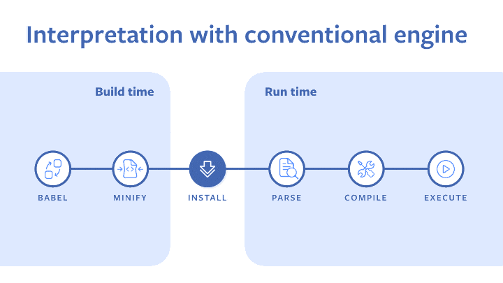

> 2023년 4월 7일, 동아리에서 발표한 자료를 기반으로 작성한 글입니다.

## 들어가며

서버, 웹, 앱 이것저것 가리지 않고 개발을 하다보니 보안에 관심이 많아졌다.
서버는 해킹을 당하는게 아닌 이상 코드가 노출 되지 않기 때문에 기본적인 수준에서는 크게 걱정을 하지 않아도 되지만,
웹과 앱을 엔드 유저가 사용하기 위해서는 바이너리 또는 코드를 직접 전달해야하기 때문에 보안에 신경을 써야한다.

어차피 서버에서 유저의 권한을 관리하기 때문에 프론트엔드에서 코드를 안전하게 전달하는 것이 그렇게 중요하지 않다고 생각할 수 있다.

그럼에도 프론트엔드 코드를 안전하게 전달하는 것이 중요한 이유가 있다.
* 프론트엔드 코드가 노출되면, 취약점 분석으로부터 쉬워진다.
* 프론트엔드 코드가 노출되면, 개발자 도구에서 JavaScript 변조가 쉬워진다.
  * 심지어 프록시를 사용해서 변조하는 것이 아닌 이미 로드 된 상태의 JavaScript를 동적으로 변조하는 것이 가능하다.
* 외주를 하다보면 데모를 보여줘야하는데, 데모 버전에서 코드가 안전하게 전달 된게 아니라면 코드를 그대로 뺏어갈 수 있다.
* 코드의 주석이 그대로 보인다면 코드를 분석하는데 도움이 된다.
* 특히 게임 같은 경우에는 프론트엔드 코드가 만든 사람 (또는 회사)의 자산 그 자체인데, 코드가 노출되면 쉬운 복사가 가능하다.

백엔드에서는 이미 코드가 가려진다고 봐도 무방하기 때문에 이 글에서는 프론트엔드 코드를 안전하게 전달하는 방법에 대해서만 다룬다.

## 프로그램의 코드를 숨기는 방법

간단한 C언어 프로그램을 준비해보았다.
이러한 코드는 CTF(Catch The Flag)라는 유형의 해킹 대회에서 많이 사용된다.

```c
// test.c
#include <stdio.h>
#include <stdlib.h>

int main(void) {
  int find_this = 0xdeadbeef;
  printf("Hello~\nGive me the flag: ");
  int received;
  scanf("%d", &received);

  if (received == find_this) {
    printf("Congratulation! You are right!\n");
    execve("/bin/sh", NULL, NULL);
  }
  else {
    printf("Wrong!\n");
  }

  return 0;
}
```

말 그대로 `0xdeadbeef`(10진수로 3735928559)를 입력하면 `/bin/sh`를 실행시켜주는 프로그램이다.
여담으로 실제 대회에서는 쉘에서 `cat flag`를 실행시켜서 플래그를 얻는 것이 목표가 된다.

이 프로그램을 컴파일하고 실행시켜보면 다음과 같은 결과를 얻을 수 있다.

```bash
$ gcc -o test test.c
$ ./test
Hello~
Give me the flag: 1234
Wrong!
$ ./test
Hello~
Give me the flag: 3735928559
Congratulation! You are right!
whoami
root
```

이제 이 프로그램을 가진 사용자(해커)의 입장에서 분석할 때 정적 분석 툴 (디스어셈블러)을 사용하게 된다.
이 툴을 사용하면 기계어[^1]로 된 프로그램의 어셈블리어[^2]를 볼 수 있고, 이를 통해서 프로그램의 동작을 예측할 수 있다.

[^1]: 0101로 이루어진 그거
[^2]: 기계어를 그나마 사람이 보기 쉽게 1:1 대응 시켜놓은 것

어떤 환경에 맞게 컴파일 되어있는지에 따라서 사용할 수 있는 디스어셈블러도 다르다.
간단하게는 objdump를 사용해서 어셈블리어를 볼 수 있다.

```bash
$ objdump -d test
```

```asm
test:	file format mach-o 64-bit x86-64

Disassembly of section __TEXT,__text:

0000000100003ed0 <_main>:
100003ed0: 55                          	pushq	%rbp
100003ed1: 48 89 e5                    	movq	%rsp, %rbp
100003ed4: 48 83 ec 10                 	subq	$16, %rsp
100003ed8: c7 45 fc 00 00 00 00        	movl	$0, -4(%rbp)
100003edf: c7 45 f8 ef be ad de        	movl	$3735928559, -8(%rbp)   ## imm = 0xDEADBEEF
100003ee6: 48 8d 3d 73 00 00 00        	leaq	115(%rip), %rdi         ## 0x100003f60 <_scanf+0x100003f60>
100003eed: b0 00                       	movb	$0, %al
100003eef: e8 60 00 00 00              	callq	0x100003f54 <_scanf+0x100003f54>
100003ef4: 48 8d 3d 7f 00 00 00        	leaq	127(%rip), %rdi         ## 0x100003f7a <_scanf+0x100003f7a>
100003efb: 48 8d 75 f4                 	leaq	-12(%rbp), %rsi
100003eff: b0 00                       	movb	$0, %al
100003f01: e8 54 00 00 00              	callq	0x100003f5a <_scanf+0x100003f5a>
100003f06: 8b 45 f4                    	movl	-12(%rbp), %eax
100003f09: 3b 45 f8                    	cmpl	-8(%rbp), %eax
100003f0c: 0f 85 26 00 00 00           	jne	0x100003f38 <_main+0x68>
100003f12: 48 8d 3d 64 00 00 00        	leaq	100(%rip), %rdi         ## 0x100003f7d <_scanf+0x100003f7d>
100003f19: b0 00                       	movb	$0, %al
100003f1b: e8 34 00 00 00              	callq	0x100003f54 <_scanf+0x100003f54>
100003f20: 48 8d 3d 76 00 00 00        	leaq	118(%rip), %rdi         ## 0x100003f9d <_scanf+0x100003f9d>
100003f27: 31 c0                       	xorl	%eax, %eax
100003f29: 89 c2                       	movl	%eax, %edx
100003f2b: 48 89 d6                    	movq	%rdx, %rsi
100003f2e: e8 1b 00 00 00              	callq	0x100003f4e <_scanf+0x100003f4e>
100003f33: e9 0e 00 00 00              	jmp	0x100003f46 <_main+0x76>
100003f38: 48 8d 3d 66 00 00 00        	leaq	102(%rip), %rdi         ## 0x100003fa5 <_scanf+0x100003fa5>
100003f3f: b0 00                       	movb	$0, %al
100003f41: e8 0e 00 00 00              	callq	0x100003f54 <_scanf+0x100003f54>
100003f46: 31 c0                       	xorl	%eax, %eax
100003f48: 48 83 c4 10                 	addq	$16, %rsp
100003f4c: 5d                          	popq	%rbp
100003f4d: c3                          	retq

Disassembly of section __TEXT,__stubs:

0000000100003f4e <__stubs>:
100003f4e: ff 25 ac 00 00 00           	jmpq	*172(%rip)              ## 0x100004000 <_scanf+0x100004000>
100003f54: ff 25 ae 00 00 00           	jmpq	*174(%rip)              ## 0x100004008 <_scanf+0x100004008>
100003f5a: ff 25 b0 00 00 00           	jmpq	*176(%rip)              ## 0x100004010 <_scanf+0x100004010>
```

위 방식은 AT&T 스타일로 어셈블리를 적은 것인데 Intel 스타일로 적은 어셈블리를 보고 싶다면 `-M intel` 옵션을 주면 된다.

```bash
$ objdump -d -M intel test
```

```asm
test:	file format mach-o 64-bit x86-64

Disassembly of section __TEXT,__text:

0000000100003ed0 <_main>:
100003ed0: 55                          	push	rbp
100003ed1: 48 89 e5                    	mov	rbp, rsp
100003ed4: 48 83 ec 10                 	sub	rsp, 16
100003ed8: c7 45 fc 00 00 00 00        	mov	dword ptr [rbp - 4], 0
100003edf: c7 45 f8 ef be ad de        	mov	dword ptr [rbp - 8], 3735928559
100003ee6: 48 8d 3d 73 00 00 00        	lea	rdi, [rip + 115]        ## 0x100003f60 <_scanf+0x100003f60>
100003eed: b0 00                       	mov	al, 0
100003eef: e8 60 00 00 00              	call	0x100003f54 <_scanf+0x100003f54>
100003ef4: 48 8d 3d 7f 00 00 00        	lea	rdi, [rip + 127]        ## 0x100003f7a <_scanf+0x100003f7a>
100003efb: 48 8d 75 f4                 	lea	rsi, [rbp - 12]
100003eff: b0 00                       	mov	al, 0
100003f01: e8 54 00 00 00              	call	0x100003f5a <_scanf+0x100003f5a>
100003f06: 8b 45 f4                    	mov	eax, dword ptr [rbp - 12]
100003f09: 3b 45 f8                    	cmp	eax, dword ptr [rbp - 8]
100003f0c: 0f 85 26 00 00 00           	jne	0x100003f38 <_main+0x68>
100003f12: 48 8d 3d 64 00 00 00        	lea	rdi, [rip + 100]        ## 0x100003f7d <_scanf+0x100003f7d>
100003f19: b0 00                       	mov	al, 0
100003f1b: e8 34 00 00 00              	call	0x100003f54 <_scanf+0x100003f54>
100003f20: 48 8d 3d 76 00 00 00        	lea	rdi, [rip + 118]        ## 0x100003f9d <_scanf+0x100003f9d>
100003f27: 31 c0                       	xor	eax, eax
100003f29: 89 c2                       	mov	edx, eax
100003f2b: 48 89 d6                    	mov	rsi, rdx
100003f2e: e8 1b 00 00 00              	call	0x100003f4e <_scanf+0x100003f4e>
100003f33: e9 0e 00 00 00              	jmp	0x100003f46 <_main+0x76>
100003f38: 48 8d 3d 66 00 00 00        	lea	rdi, [rip + 102]        ## 0x100003fa5 <_scanf+0x100003fa5>
100003f3f: b0 00                       	mov	al, 0
100003f41: e8 0e 00 00 00              	call	0x100003f54 <_scanf+0x100003f54>
100003f46: 31 c0                       	xor	eax, eax
100003f48: 48 83 c4 10                 	add	rsp, 16
100003f4c: 5d                          	pop	rbp
100003f4d: c3                          	ret

Disassembly of section __TEXT,__stubs:

0000000100003f4e <__stubs>:
100003f4e: ff 25 ac 00 00 00           	jmp	qword ptr [rip + 172]   ## 0x100004000 <_scanf+0x100004000>
100003f54: ff 25 ae 00 00 00           	jmp	qword ptr [rip + 174]   ## 0x100004008 <_scanf+0x100004008>
100003f5a: ff 25 b0 00 00 00           	jmp	qword ptr [rip + 176]   ## 0x100004010 <_scanf+0x100004010>
```

코드 주소 100003edf에서 3735928559라는 숫자를 볼 수 있다.
원본 코드가 간단한 이유도 있겠지만 이런식으로 아무런 조치를 취하지 않으면 분석에 너무나도 취약한 바이너리가 전달된다.

심지어 hex-rays사의 [ida](https://hex-rays.com/ida-free/)라는 프로그램에서는 디컴파일 기능을 제공하기 때문에
다소 어려울 수 있는 어셈블리를 쉬운 C언어로 보여주기도 한다.
최근 업데이트로 무료 버전도 한정된 아키텍쳐에 한해서 클라우드를 사용한 디컴파일이 가능하게 바뀌었다.


당연히 컴파일하면 변수명 같은 심볼은 전부 제거 되기 때문에 v4, v5처럼 보여준다.

이 코드를 보기 어렵게 만드는 간단한 방법은 [upx](https://upx.github.io/)(Ultimate Packer for eXecutables)를 사용하는 것이다.


Packer라는 이름 답게 코드를 기가막히게 압축해줄 뿐더러,
upx로 패킹 되어있다는 사실을 모르는 사람에게는 그저 이상한 어셈블리일 뿐이다.
(원리는 간단하게 코드를 압축하고, 실행시에 압축을 풀어서 실행시키는 것이기에 압축 그 이상의 기능을 제공하진 않는다.)


위 처럼 ida에서도 분석이 바로 되지 않는다.

하지만 upx로 패킹 되어있다는 것을 알고 있다면 upx를 사용해서 복원이 가능하기에
이걸로 많은 것을 기대할 수는 없다.


upx말고도 다른 방법으로 코드를 숨길 수 있지만,
결국 실행하는 입장(컴퓨터한테는)에서는 원래 코드가 필요하기 때문에 언젠가는 원래 코드가 메모리에 올라간다고 보면 된다.

## 프론트엔드에서 한계

그렇다면 컴파일을 거치지 않는 JavaScript는 더 취약한 것이 아닐까라고 생각할 수 있는데 맞다.


컴파일 언어는 컴파일러가 코드를 최적화하고, 실행에 꼭 필요한 내용만 남기기 때문에 코드가 많이 숨겨지지만,
반대로 인터프리터 언어는 개발한 코드 그 자체로 런타임 프로그램과 같이 실행되기 때문에 코드를 숨기는 것이 어렵다.

그래서 난독화(obfuscation)을 사용해서 코드를 숨기게 된다.

여기에서 염두에 두어야 하는 것은 난독화도 다시 원래 코드로 돌아와야 실행이 가능하기 때문에
런타임에서 오버해드가 발생하고 따라서 성능이 일부 저하될 수 있다.

## 난독화

### uglify

변수명을 바꾸는 정도의 간단한 난독화는 성능 저하 없이 코드를 읽기 어렵게 만드는 것이 가능하다.
하이브리드 언어인 Java에서도 proguard를 사용하면 필드, 변수 이름을 a, b, c같이 짧은 이름으로 바꿔준다.

uglifyjs를 사용하면 코드 양을 줄이면서도 성능 저하 없이 코드를 읽기 어렵게 만들 수 있다.

webpack같은 번들러를 사용한다면 플러그인을 사용해서 쉽게 난독화를 적용할 수 있다.

```js
// webpack.config.js
const UglifyJsPlugin = require('uglifyjs-webpack-plugin');

module.exports = {
  // ...
  optimization: {
    minimizer: [
      new UglifyJsPlugin({
        uglifyOptions: {
          compress: {
            drop_console: true,
          },
          output: {
            comments: false,
          },
        },
      }),
    ],
  },
};
```

또한 분석에 도움이 될 수 있는 주석 제거나 콘솔 로그 제거도 가능하다.

### obfuscator

uglifyjs는 변수명을 바꾸는 정도의 간단한 난독화만 가능하기 때문에
코드를 더욱 읽기 어렵게 만들고 싶다면 [JavaScript Obfuscator Tool](https://obfuscator.io)를 사용할 수 있다.

```js
const a = 3;
const b = 8;
console.log('test', a + b, a * b);
```

위와 같은 자바스크립트 코드가 있다면 obfuscator tool을 사용하면 복잡하게 바뀐다.

```js
function _0x4f2c(_0x599706,_0x3f9402){const _0xde6349=_0xde63();return _0x4f2c=function(_0x4f2cdc,_0x37debb){_0x4f2cdc=_0x4f2cdc-0x170;let _0xd6f5e5=_0xde6349[_0x4f2cdc];return _0xd6f5e5;},_0x4f2c(_0x599706,_0x3f9402);}const _0x1d1a3d=_0x4f2c;function _0xde63(){const _0x14009c=['582232DdmSQe','1475289qOlWUH','734435naxngH','1945152hjvWLN','165340tlxAyd','6PdvqDf','2cMWNOZ','test','195516iPoQIS','94027KkdHyy'];_0xde63=function(){return _0x14009c;};return _0xde63();}(function(_0x53ee2c,_0x59a9f4){const _0xce8482=_0x4f2c,_0x249a22=_0x53ee2c();while(!![]){try{const _0x3362e9=-parseInt(_0xce8482(0x176))/0x1+parseInt(_0xce8482(0x173))/0x2*(parseInt(_0xce8482(0x178))/0x3)+-parseInt(_0xce8482(0x175))/0x4+parseInt(_0xce8482(0x179))/0x5*(-parseInt(_0xce8482(0x172))/0x6)+-parseInt(_0xce8482(0x171))/0x7+-parseInt(_0xce8482(0x177))/0x8+parseInt(_0xce8482(0x170))/0x9;if(_0x3362e9===_0x59a9f4)break;else _0x249a22['push'](_0x249a22['shift']());}catch(_0x1535d8){_0x249a22['push'](_0x249a22['shift']());}}}(_0xde63,0x4e8a3));const a=0x3,b=0x8;console['log'](_0x1d1a3d(0x174),a+b,a*b);
```

하지만 아무리 이것을 사용한다고 해도 로직이 완전히 감춰지지 않는다.

맨 마지막을 보면 a+b, a*b가 그대로 살아있는 것을 볼 수 있다.
또 조금 앞으로 가면 a는 3이고 b는 8이라는 것도 보인다.

obfuscator도 webpack 플러그인을 제공하기 때문에 쉽게 사용할 수 있다.

```js
// webpack.config.js
const JavaScriptObfuscator = require('webpack-obfuscator');

module.exports = {
  // ...
  plugins: [
    new JavaScriptObfuscator({
      rotateUnicodeArray: true,
    }),
  ],
};
```

### webpack

uglify나 obfuscator모두 webpack을 사용해서 편하게 사용할 수 있다.

하지만 webpack 설정을 잘못하게 된다면 디버깅 용 `.map` 파일이 함께 생성 되어서
결국 원본 코드가 그대로 노출 되는 셈이 된다.


소스맵을 생성하더라도 배포 환경에서는 접근을 불가능하게 하거나
배포 전에 sentry 같은 서비스에 소스맵을 업로드 한 후에는 지워야한다.

webpack 설정 중 `devtool` 옵션으로 해당 기능을 설정할 수 있다.

```js
// webpack.config.js
module.exports = {
  // ...
  devtool: 'none',
};
```

devtool 설정 중 소스맵은 만들지만 원본 코드는 담지 않는 기능도 있기 때문에 적절히 사용하면 될 것 같다.

#### CRA (Create-React-App)

CRA를 사용중이라면 빌드 시에 GENERATE_SOURCEMAP 환경 변수를 false로 설정하면 된다.

```json
// package.json
{
  "scripts": {
    "build": "GENERATE_SOURCEMAP=false react-scripts build"
  }
}
```

## HermesJS

React Native를 사용한다면 HermesJS[^3]를 사용하는 것도 좋은 방법이 될 수 있다.

기본적으로는 ReactNative의 빌드에서는 번들링된 파일을 생성하지만, HermesJS를 사용하는 옵션을 사용한다면 미리 컴파일된 파일을 생성한다.



HermesJS를 사용하면 컴파일 언어처럼 미리 컴파일된 파일을 생성하기 때문에 코드를 숨길 수 있다.
그 뿐만아니라 컴파일이라는 이점 때문에 실행 속도도 빨라진다.


[^3]: https://hermesengine.dev/, https://engineering.fb.com/2019/07/12/android/hermes/

아까 봤던 JavaScript코드를 HermesJS를 사용해서 빌드하면 다음과 같이 바뀐다.

```js
const a = 3;
const b = 8;
console.log('test', a + b, a * b);
```


하지만 hermes를 사용한 코드도 디컴파일이 가능하다.

https://github.com/P1sec/hermes-dec


## WASM

몇몇 언어는 컴파일을 하더라도 C언어와 달리 정적 분석이 쉽지 않은 경우가 있다.
이러한 언어를 사용해서 WASM(WebAssembly)로 만들면 코드를 더욱 확실히 숨길 수 있다.

웹으로 만들어진 게임은 그 성능을 목적으로 WASM을 많이 사용하고는 하는데,
성능도 챙기면서 자산을 보호하는 것도 가능한 것이다.

## 결론

프론트엔드 코드를 완전히 안전하게 전달하는 것은 어렵다.
결국 코드는 엔드 유저에게 전달이 된 것이고, 그러면 해커는 (물론 엄청난 노력이 들겠지만) 언젠가는 코드를 분석할 수 있다.

프론트엔드 코드도 개발자가 노력을 해서 만들어낸 자산이기 때문에 그 자산을 보호하는 것은 중요하다.
