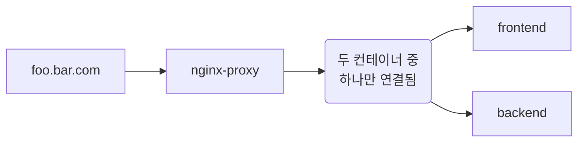
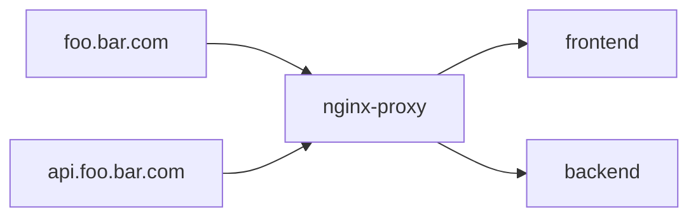

## nginx, reverse-proxy

누군가의 부탁으로 서버 세팅을 봐주었다.

[reverse-proxy](https://hub.docker.com/r/jwilder/nginx-proxy) 이미지를 사용해서
80(HTTP), 443(HTTPS) 포트를 리스닝하고 있었고,
이 이미지를 사용하면 다른 서버를 띄울 때 `VIRTUAL_HOST` 환경변수를 설정해서 호스트를 연결할 수 있다.

```bash
$ docker run -d -p 80:80 -v /var/run/docker.sock:/tmp/docker.sock:ro jwilder/nginx-proxy
$ docker run -d -e VIRTUAL_HOST=foo.bar.com ...
```

도커 socker을 nginx-proxy에 연결해서 현재 떠있는 컨테이너를 nginx-proxy가 감지하는 방식으로 보인다.

질문을 준 상황에서 문제는 backend와 frontend서버가 모두 docker로 돌아가고 있었고,
두 서버의 VIRTUAL_HOST가 동일하게 설정되어 있었던 것이다.



여기에서 기본적으로 frontend는 react-router단에서 모든 라우터가 /main으로 시작하게 되어있었지만,
backend도 충분히 그 요청을 받을 수 있는 환경이었다.

그래서 확률적으로 프론트가 가져가야하는 요청이 백엔드로 가는 경우가 있었고,
이런 경우에는 백엔드에서 404를 리턴하게 되어있었다.

이런 문제를 해결하기 위해서는 frontend와 backend의 VIRTUAL_HOST를 다르게 설정해주면 된다.


