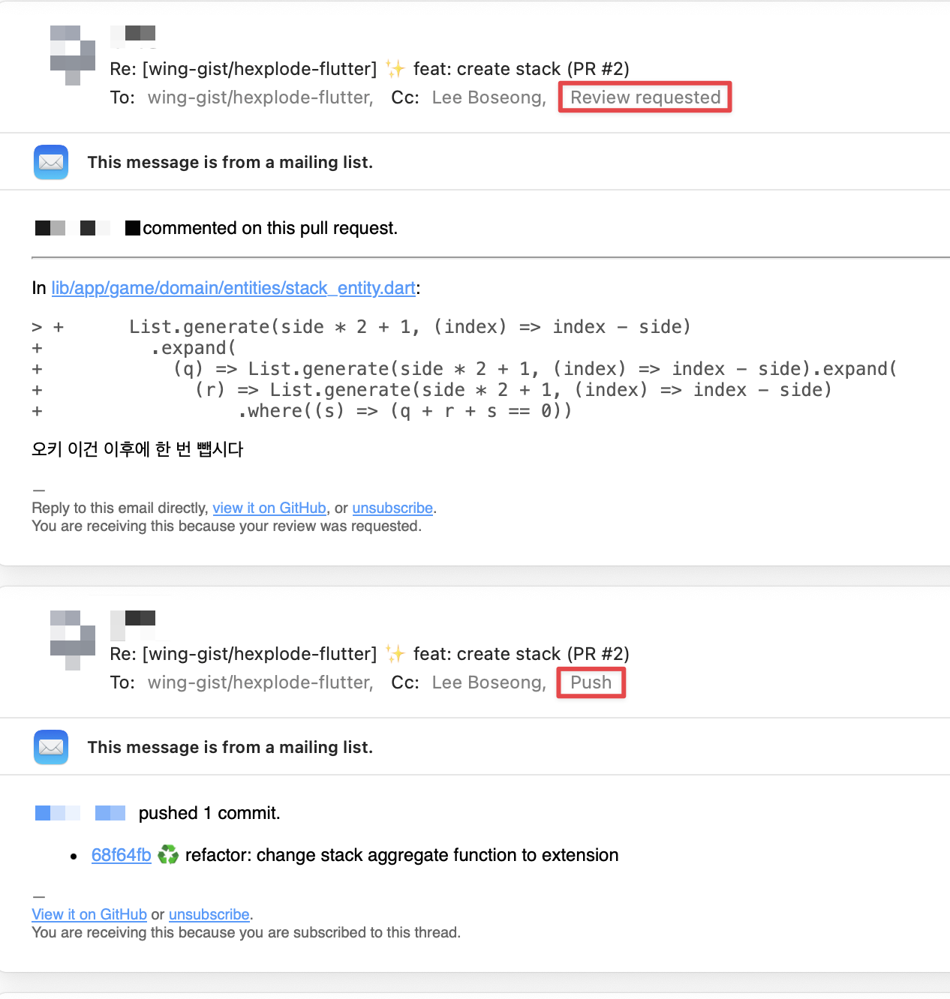

GitHub에서는 이메일을 통해서 알림을 받을 수 있다.
나는 GitHub에서 누가 Review Request를 보냈을 때나, 댓글이 달렸을 때, 관심을 가지고 있는 이슈에
업데이트가 생겼을 때 등, 이메일을 통해서 알림을 받고 있다. OS에 내장 되어있는 메일 클라이언트를 사용하고
있는데, 메일이 수신 되었을 때 거의 바로 메일이 왔다는 알림이 뜨기 때문에 바로바로 놓치지 않고 확인이
가능한 것 같다. 보통은 앱을 통해서 Push Notification을 보내는 것이 일반적이지만, GitHub는
이메일을 활용한 알림을 잘 활용하고 있는 것 같다.

메일은 굉장히 형식적이다. 물론 본문을 CSS로 꾸민다면 중요한 내용을 강조하는 게 쉽지만 GitHub는
그러한 방식을 채택하지 않았다. 스타일이라고 해봤자 글자 색상, 글자 굵기 정도만 바뀌는게 전부이다.
아마 가독성을 더욱 높이기 위해서 이러한 방식을 택한 것 같다. 오히려 과한 스타일링은 때로 피로하게 만들
수 있고, 메일을 읽는 시간이 오래 걸릴 수도 있다. 이것이 내가 생각한 GitHub 메일의 **첫번째 UX**이다.

이뿐만 아니라 GitHub에서는 메일을 통해서 이슈나 PR에 댓글을 달 수 있다. 메일의 링크로 들어가서
웹 상에서 댓글을 다는 것이 아니라 메일에 답장을 해서 댓글을 달 수 있다. 메일 클라이언트에서 벗어나지 않고
빠르게 작업을 이어나갈 수 있게 한 것이다. 보통 서비스들은 no-reply@example.com 등의 주소로 메일을
보내서 답장이 불가능하다는 것을 나타내는데, GitHub는 이와 다르다. 이것이 내가 생각한 GitHub 메일의
**두번째 UX**이다.

메일의 메타데이터에서도 숨겨진 디자인을 볼 수 있다.

이어지는 알림의 경우는 메일 답장을 활용해서 Re: 키워드가 붙는 것을 볼 수 있다. 이것은 메일 클라이언트에서
관련이 있는 메일을 모아서 보여주는 기능을 활용할 수 있게 해준다. 이것이 내가 생각한 GitHub 메일의
**세번째 UX**이다.

그리고 메일의 발신자에서 이름은 댓글을 작성한 사람의 이름으로 되어있다. 메일 클라이언트에서도 제일 처음에
보여주는 것이 발신자 정보이기 때문에 누가 댓글을 달았는지 바로 알 수 있다. 참조(cc)를 활용한 부분도
보이는데, 빨간색으로 표시된 Review requested, Push처럼 현재 상태를 메일의 본문이 아닌
메일 헤더에서부터 알 수 있게 해두었다. 이것이 내가 생각한 GitHub 메일의 **네번째 UX**이다.

메일의 본문으로 내려가보면 파일, 유저, 커밋마다 링크가 다 달려있다. 굳이 GitHub 웹으로 넘어가지 않아도,
레포지토리를 clone 받지 않아도, 해당하는 타겟으로 이동할 수 있다. 이것이 내가 생각한 GitHub 메일의
**다섯번째 UX**이다.

## 마치며

GitHub의 메일은 굉장히 잘 디자인 되어있다. 메일을 통해서도 GitHub의 서비스를 잘 활용할 수 있게 해주고,
메일을 통해서도 GitHub의 서비스를 잘 이해할 수 있게 해준다. 이런 디자인은 굉장히 잘 되어있다고 생각한다.
