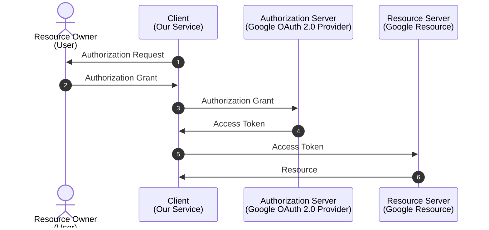
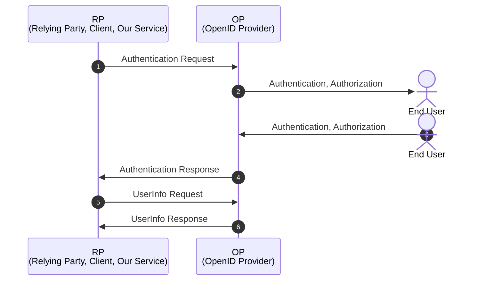
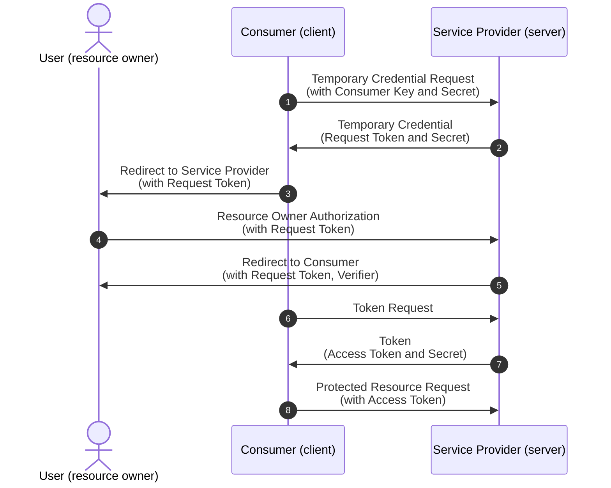
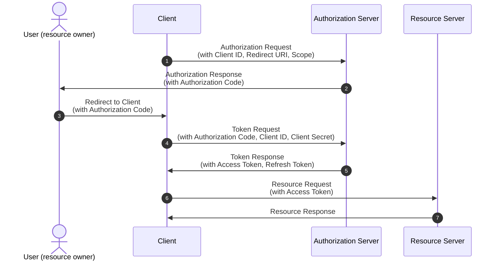
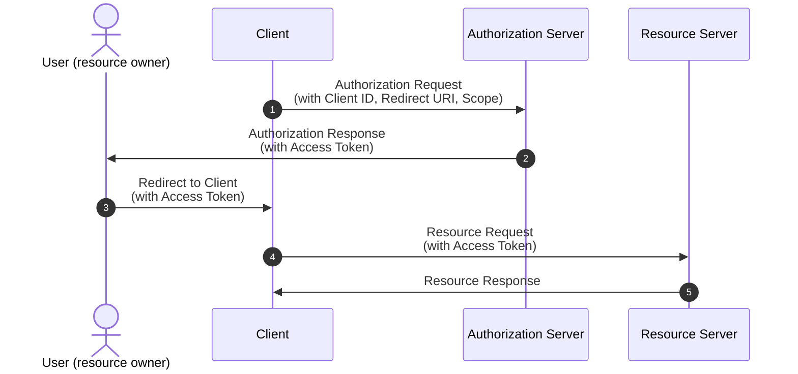

## 들어가며

OpenID Connect는 OAuth 2.0 프로토콜 위에서 돌아가는 인증 레이어이다[^1].

[^1]: OpenID Connect 1.0 is a simple identity layer on top of the OAuth 2.0 [RFC6749] protocol.
(https://openid.net/specs/openid-connect-core-1_0.html#Introduction)

그렇기 때문에 OpenID Connect의 정확한 과정을 이해하기 위해서는
[OAuth 2.0 인가 프레임워크(OAuth 2.0 Authorization Framework)](https://datatracker.ietf.org/doc/html/rfc6749)에 대한
이해가 필수적이다.

그전에 공식 스펙, RFC 문서를 읽다보면 인증(Authentication)과 인가(Authorization)에 대한 용어가
자주 등장할 것이다.

이 두 용어에 대해 간단히 정리하고 OpenID Connect에 대해 알아보자.

* **인증**(Authentication)은 사용자가 자신이 주장하는 것을 증명하는 것이다.
  줄여서 Authn이라고도 한다.
  쉽게 말하면 로그인이라고 생각하면 된다.
* **인가**(Authorization)는 인증된 사용자가 특정 리소스에 접근할 수 있는 권한이 있는지를 확인하는 것이다.
  줄여서 Authz라고도 한다.
  쉽게 말하면 로그인 후에 특정 페이지에 접근할 수 있는지를 확인하는 것이다.

만약 인증에 실패하게 되면 HTTP 401 Unauthorized 에러를 반환하고,
인가에 실패하게 되면 HTTP 403 Forbidden 에러를 반환한다.

---

OpenID Connect와 OAuth 2.0이 각자 맡고 있는 역할이 다르다.  
**OpenID Connect**는 **인증**(Authentication)을 담당하고,
**OAuth 2.0**은 **인가**(Authorization)를 담당한다[^2].

[^2]: OpenID Connect implements authentication as an extension to the OAuth 2.0 authorization process.
(https://openid.net/specs/openid-connect-core-1_0.html#Introduction)

이것이 무슨 말인가 하면 우리가 자주 사용하는 OAuth 2.0 Provider들의 예시로 설명 가능하다.

Google의 OAuth 2.0 기능을 사용한다면
우리의 서비스에서 구글의 리소스에 접근할 수 있는 권한을 얻을 수 있다.
이때 우리의 서비스는 Google의 리소스에 접근할 수 있는 권한을 얻기 위해
Google의 OAuth 2.0 Provider를 사용하는 것이다.

1. 서비스가 사용자에게 구글의 리소스에 대한 권한을 요청한다.
2. 사용자가 권한을 허용하면 credential을 서비스에 전달한다.
3. 서비스는 credential을 이용해 구글의 리소스에 대한 권한을 요청한다.
4. 구글 OAuth 2.0 Provider는 서비스에게 Access Token을 발급한다.
5. 서비스는 Access Token을 이용해 구글의 리소스에 접근한다.
6. 구글의 리소스를 서비스에게 전달한다.

이러한 이유로 OAuth 2.0 Provider는 인가(Authorization)를 담당하는 것이다.

반면에 OpenID Connect는 인증(Authentication)을 담당한다.
즉, OAuth 2.0 Provider를 이용해 다른 서비스의 리소스에 접근할 수 있는 권한을 얻을 수 있는 것이다.

1. 서비스가 인증을 요청한다.
2. 인증 서버는 사용자에게 인증을 요청한다.
3. 사용자는 인증을 완료하고 인증 서버에게 인증을 완료했다고 알린다.
4. 인증 서버는 서비스에게 인증이 완료되었다고 알린다.
   이때 ID Token과 Access Token을 전달한다.
5. 서비스는 Access Token을 사용하여 인증 서버에게 사용자 정보를 요청한다.
6. 인증 서버는 서비스에게 사용자 정보를 전달한다.

여기에서 ID Token만으로도 사용자를 식별할 수 있고,
Access Token을 이용해서 OP로부터 사용자 정보를 가져올 수 있기 때문에
OpenID Connect는 인증(Authentication)을 담당하는 것이다.

OpenID Connect는 OAuth 2.0 Authorization Framework [RFC6749]를 확장한 것이기 때문에
인증과 함께 인가도 가능하다.

## OAuth 1.0 프로토콜

OAuth가 등장하기 이전에는 사용자가 자신의 ID와 Password를 다른 서비스에게 전달해야만
다른 서비스의 리소스에 접근할 수 있었다. (HTTP Basic Authentication[^3])

[^3]:
    가장 최근의 HTTP Basic Authentication은 RFC7617이다
    (https://datatracker.ietf.org/doc/html/rfc7617)
    이전에는 RFC2617이었다. (https://datatracker.ietf.org/doc/html/rfc2617)

하지만 이렇게 되면 사용자의 ID와 Password가 다른 서비스에게 노출되는 문제가 발생한다.
또한 권한을 선택적으로 부여하지도 못한다.

OAuth와 같은 표준이 있기 이전에는 각 회사들이 자신들만의 인증 방식을 사용했기 때문에
인증 방식을 사용해야하는 개발자 입장에서는 매우 불편했다.

이런 각 인증방식을 통합하기 위해서 [OAuth 1.0 프로토콜](https://datatracker.ietf.org/doc/html/rfc5849)이 등장했다.

OAuth 1.0 프로토콜은 사용자가 자신의 ID와 Password를 다른 서비스에게 전달하지 않고도
다른 서비스의 리소스에 접근할 수 있도록 해주는 프로토콜이다[^4]

[^4]:
    It also provides a process for end-users to authorize third-
    party access to their server resources without sharing their
    credentials (typically, a username and password pair), using user-
    agent redirections.

1. Consumer는 Service Provider에게 임시 자격 증명을 요청한다.
   이때 Consumer는 미리 발급 받은 Consumer Key와 Consumer Secret을 전달한다.
2. Service Provider는 임시 자격 증명을 발급한다.
3. Consumer는 Service Provider에게 임시 자격 증명을 이용해 사용자를 인증하도록 요청한다.
4. 사용자는 Service Provider에게 사용자 인증을 요청한다.
5. Service Provider는 사용자 인증을 완료하고 Consumer에게 사용자 인증이 완료되었다고 알린다.
   이때 Request Token과 Verifier를 전달한다.
6. Consumer는 Service Provider에게 Access Token을 요청한다.
7. Service Provider는 Access Token을 발급한다.
8. Consumer는 Service Provider에게 Access Token을 이용해 리소스에 접근하도록 요청한다.

OAuth 2.0을 알고 있는 사람이라면 이전의 OAuth 1.0은 굉장히 복잡하다고 느낄 것이다.
또한 Access Token이 한번 발급되면 만료가 되지 않는다는 점도 보안에 취약하다고 느낄 수 있다.

## OAuth 2.0 인가 프레임워크

[OAuth 2.0](https://datatracker.ietf.org/doc/html/rfc6749)에서는
TLS를 활용하여 인증 과정을 단순화 하였다. 이전에 없었던 Access Token의 만료 기간도 도입되었다.
뿐만 아니라 OAuth 1.0에서는 허용할 수 있는 권한을 선택적으로 부여할 수 없었지만
OAuth 2.0에서는 권한을 선택적으로 부여할 수 있도록 scope가 도입되었다.

이전의 OAuth 1.0과는 호환 되지 않는 방식이며,
인가라는 목적은 같지만 구현 방식이 완전히 다르다고 보면 된다.

OAuth 2.0에는 여러가지 인증 방식이 존재한다.

### Authorization Code Grant

https://datatracker.ietf.org/doc/html/rfc6749#section-4.1

1. Client는 Authorization Server에게 인가를 요청한다.
   이때 Client는 미리 발급 받은 Client ID와 Redirect URI, Scope를 전달한다.
2. Authorization Server는 사용자에게 인가를 요청한다.
3. 사용자는 인가를 허용하면 Authorization Code를 전달한다.
4. Client는 Authorization Code를 이용해 Access Token을 요청한다.
   이때 Client는 미리 발급 받은 Client ID와 Client Secret을 전달한다.
5. Authorization Server는 Access Token을 발급한다.
6. Client는 Access Token을 이용해 리소스에 접근하도록 요청한다.
7. Resource Server는 리소스를 전달한다.

위는 OAuth 2.0이 지원하는 인증 방식 중 하나인 Authorization Code Grant 방식이다.
유저는 Authorization Code를 클라이언트에 전달하게 되고,
클라이언트가 인가 서버에 접근하여 Access Token을 발급받는다.
서버(클라이언트)에서 Access Token을 발급받는 방식이기 때문에
Access Token이 노출 되지 않는다는 장점이 있다.

### Implicit Grant

https://datatracker.ietf.org/doc/html/rfc6749#autoid-41

1. Client는 Authorization Server에게 인가를 요청한다.
   이때 Client는 미리 발급 받은 Client ID와 Redirect URI, Scope를 전달한다.
2. Authorization Server는 사용자에게 인가를 요청한다.
3. 사용자는 인가를 허용하면 Access Token을 전달한다.
4. Client는 Access Token을 이용해 리소스에 접근하도록 요청한다.
5. Resource Server는 리소스를 전달한다.

위는 OAuth 2.0이 지원하는 인증 방식 중 하나인 Implicit Grant 방식이다.
클라이언트에서 Access Token을 발급받지 않고,
유저에게(User-Agent, 주로 브라우저) 직접 발급받는 방식이다.
클라이언트(백엔드 서버)없이 빠르게 구현할 수 있지만 Access Token이 노출 될 수 있다는 단점이 있다.
SPA(Single Page Application)나 Mobile Application에서 사용하기 적합하다.

### Resource Owner Password Credentials Grant

## 참고

* [OAuth 2.0 인가 프레임워크](https://datatracker.ietf.org/doc/html/rfc6749)
* [OAuth 1.0 프로토콜](https://datatracker.ietf.org/doc/html/rfc5849)
* [OpenID Connect 1.0](https://openid.net/specs/openid-connect-core-1_0.html)
* [OAuth란? & OAuth 1 vs OAuth2](https://velog.io/@hyg8702/OAuth%EB%9E%80-OAuth1-vs-OAuth2)
* [잡 인터뷰 - OAuth 1.0과 OAuth 2.0의 차이점](https://canada-coder.tistory.com/entry/%EC%9E%A1-%EC%9D%B8%ED%84%B0%EB%B7%B0-2-OAuth-10-%EA%B3%BC-OAuth-20%EC%9D%98-%EC%B0%A8%EC%9D%B4%EC%A0%90)
* [Oauth 2.0과 OpenID Connect 프로토콜 정리](https://velog.io/@jakeseo_me/Oauth-2.0%EA%B3%BC-OpenID-Connect-%ED%94%84%EB%A1%9C%ED%86%A0%EC%BD%9C-%EC%A0%95%EB%A6%AC)
* [Google은 Refresh Token을 쉽게 내주지 않는다](https://hyeonic.github.io/woowacourse/dallog/google-refresh-token.html)
* [OpenID Connect - Google](https://developers.google.com/identity/openid-connect/openid-connect)
* [OAuth 인증서버 만들기 with(oidc-provider)](https://cozy-ho.github.io/server/2021/07/19/Nodejs%EB%A1%9C-OAuth-%EC%9D%B8%EC%A6%9D%EC%84%9C%EB%B2%84-%EB%A7%8C%EB%93%A4%EA%B8%B0-oidc-provider.html)
