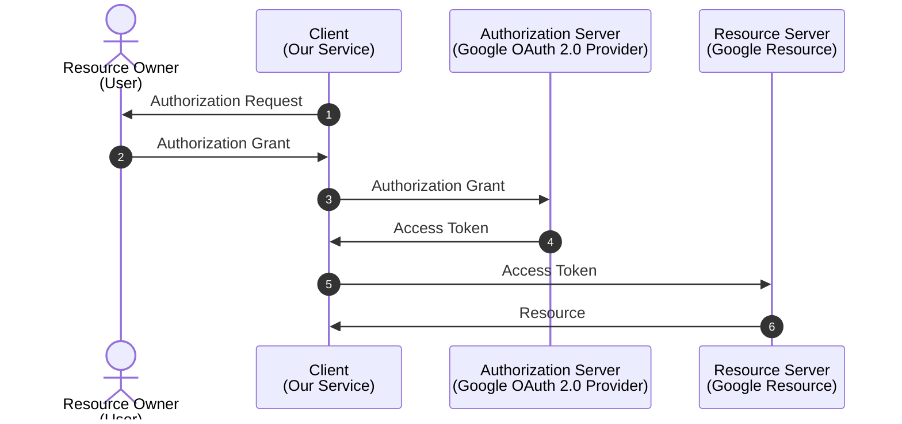
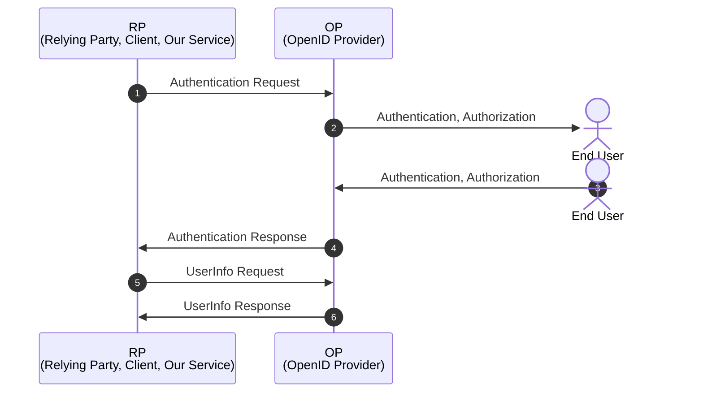

## 들어가며

OpenID Connect는 OAuth 2.0 프로토콜 위에서 돌아가는 인증 레이어이다[^1].

[^1]: OpenID Connect 1.0 is a simple identity layer on top of the OAuth 2.0 [RFC6749] protocol.
(https://openid.net/specs/openid-connect-core-1_0.html#Introduction)

그렇기 때문에 OpenID Connect의 정확한 과정을 이해하기 위해서는
[OAuth 2.0 인가 프레임워크(OAuth 2.0 Authorization Framework)](https://datatracker.ietf.org/doc/html/rfc6749)에 대한
이해가 필수적이다.

그전에 공식 스펙, RFC 문서를 읽다보면 인증(Authentication)과 인가(Authorization)에 대한 용어가
자주 등장할 것이다.

이 두 용어에 대해 간단히 정리하고 OpenID Connect에 대해 알아보자.

* **인증**(Authentication)은 사용자가 자신이 주장하는 것을 증명하는 것이다.
  줄여서 Authn이라고도 한다.
  쉽게 말하면 로그인이라고 생각하면 된다.
* **인가**(Authorization)는 인증된 사용자가 특정 리소스에 접근할 수 있는 권한이 있는지를 확인하는 것이다.
  줄여서 Authz라고도 한다.
  쉽게 말하면 로그인 후에 특정 페이지에 접근할 수 있는지를 확인하는 것이다.

만약 인증에 실패하게 되면 HTTP 401 Unauthorized 에러를 반환하고,
인가에 실패하게 되면 HTTP 403 Forbidden 에러를 반환한다.

---

OpenID Connect와 OAuth 2.0이 각자 맡고 있는 역할이 다르다.  
**OpenID Connect**는 **인증**(Authentication)을 담당하고,
**OAuth 2.0**은 **인가**(Authorization)를 담당한다[^2].

[^2]: OpenID Connect implements authentication as an extension to the OAuth 2.0 authorization process.
(https://openid.net/specs/openid-connect-core-1_0.html#Introduction)

이것이 무슨 말인가 하면 우리가 자주 사용하는 OAuth 2.0 Provider들의 예시로 설명 가능하다.

Google의 OAuth 2.0 기능을 사용한다면
우리의 서비스에서 구글의 리소스에 접근할 수 있는 권한을 얻을 수 있다.
이때 우리의 서비스는 Google의 리소스에 접근할 수 있는 권한을 얻기 위해
Google의 OAuth 2.0 Provider를 사용하는 것이다.

1. 서비스가 사용자에게 구글의 리소스에 대한 권한을 요청한다.
2. 사용자가 권한을 허용하면 credential을 서비스에 전달한다.
3. 서비스는 credential을 이용해 구글의 리소스에 대한 권한을 요청한다.
4. 구글 OAuth 2.0 Provider는 서비스에게 Access Token을 발급한다.
5. 서비스는 Access Token을 이용해 구글의 리소스에 접근한다.
6. 구글의 리소스를 서비스에게 전달한다.

이러한 이유로 OAuth 2.0 Provider는 인가(Authorization)를 담당하는 것이다.

반면에 OpenID Connect는 인증(Authentication)을 담당한다.
즉, OAuth 2.0 Provider를 이용해 다른 서비스의 리소스에 접근할 수 있는 권한을 얻을 수 있는 것이다.

1. 서비스가 인증을 요청한다.
2. 인증 서버는 사용자에게 인증을 요청한다.
3. 사용자는 인증을 완료하고 인증 서버에게 인증을 완료했다고 알린다.
4. 인증 서버는 서비스에게 인증이 완료되었다고 알린다.
   이때 ID Token과 Access Token을 전달한다.
5. 서비스는 Access Token을 사용하여 인증 서버에게 사용자 정보를 요청한다.
6. 인증 서버는 서비스에게 사용자 정보를 전달한다.

여기에서 ID Token만으로도 사용자를 식별할 수 있고,
Access Token을 이용해서 OP로부터 사용자 정보를 가져올 수 있기 때문에
OpenID Connect는 인증(Authentication)을 담당하는 것이다.

OpenID Connect는 OAuth 2.0 Authorization Framework [RFC6749]를 확장한 것이기 때문에
인증과 함께 인가도 가능하다.

## 참고

* [OAuth 2.0 인가 프레임워크](https://datatracker.ietf.org/doc/html/rfc6749)
* [OAuth 1.0 프로토콜](https://datatracker.ietf.org/doc/html/rfc5849)
* [OpenID Connect 1.0](https://openid.net/specs/openid-connect-core-1_0.html)
* [OAuth란? & OAuth 1 vs OAuth2](https://velog.io/@hyg8702/OAuth%EB%9E%80-OAuth1-vs-OAuth2)
* [잡 인터뷰 - OAuth 1.0과 OAuth 2.0의 차이점](https://canada-coder.tistory.com/entry/%EC%9E%A1-%EC%9D%B8%ED%84%B0%EB%B7%B0-2-OAuth-10-%EA%B3%BC-OAuth-20%EC%9D%98-%EC%B0%A8%EC%9D%B4%EC%A0%90)
* [Oauth 2.0과 OpenID Connect 프로토콜 정리](https://velog.io/@jakeseo_me/Oauth-2.0%EA%B3%BC-OpenID-Connect-%ED%94%84%EB%A1%9C%ED%86%A0%EC%BD%9C-%EC%A0%95%EB%A6%AC)
* [Google은 Refresh Token을 쉽게 내주지 않는다](https://hyeonic.github.io/woowacourse/dallog/google-refresh-token.html)
* [OpenID Connect - Google](https://developers.google.com/identity/openid-connect/openid-connect)
* [OAuth 인증서버 만들기 with(oidc-provider)](https://cozy-ho.github.io/server/2021/07/19/Nodejs%EB%A1%9C-OAuth-%EC%9D%B8%EC%A6%9D%EC%84%9C%EB%B2%84-%EB%A7%8C%EB%93%A4%EA%B8%B0-oidc-provider.html)
