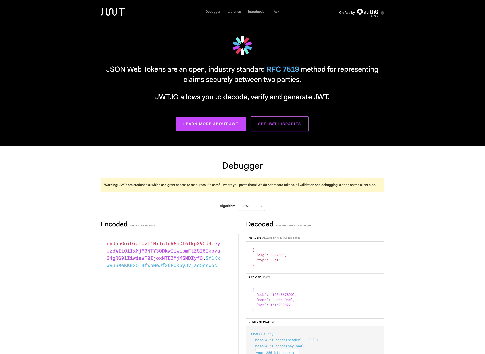

## JWT

OpenID Connect에 대한 글을 읽거나 OpenID Provider를 사용하면 ID Token이라는 녀석을 만날 수
있다. ID Token의 모양을 보면 JWT랑 닮았지만, 흔히 사용할 수 있는 JWT와는 살짝 성격이 다르다.

JWT는 JSON Web Token의 약자로, JSON을 사용하는 토큰을 뜻한다. JWT는 토큰을 만들기 위한 표준이고
JWS(JSON Web Signature) 또는 JWE(JSON Web Encryption)를 사용해서 구현된다.

기존에 사용하던 JWT를 살펴보자. 우선 JWT는 Header, Payload, Signature 세 부분으로 구성 되어있고
각 부분은 .으로 구분되어있다. Header는 JWT에 대한 기본 정보를 담고 있고, Payload는 JWT의 내용을
담고 있으며, 마지막 Signature는 JWT가 유효한지 검증하는데에 사용된다.

```text
Header.Payload.Signature
```

JWT에서 각 부분은 원본 데이터를 url-safe한 Base64로 인코딩한 값이다. url-safe한 Base64는
원래 Base64에서 +, / 문자를 -, \_로 치환하고 패딩을 뜻하는 = 문자를 제거한 것이다. 패딩이 없더라도
글자 길이를 보면 패딩이 몇 바이트인지 알 수 있기 때문이다. JWS를 사용하는 경우에는 따로 암호화를 하는
것이 아니기 때문에 Header와 Payload 부분은 Base64 디코딩만 하면 원래 데이터가 나온다.

가장 빠르게 JWT를 만들 수 있는 방법은 [jwt.io](https://jwt.io)를 사용하는 것이다.



기본으로 제공 되어있는 JWT를 보면 Header에는 알고리즘과 타입이, Payload에는 sub, name, iat같은
정보들이, Signature의 식을 보면 header와 payload를 합친 것을 HMACSHA256 알고리즘을 사용하여
해싱한 값이 들어있음을 알 수 있다.

### Header

Header에는 JWT를 해석하는데에 필요한 기본적인 정보들이 JSON 형태로 들어있다. 그래서 JOSE Header
(JSON Object Signing and Encryption)라고한다. JWS와 JWE의 명세에 각각 정의되어있는 파라미터가
있으며, JWT 명세에서는 typ, cty에 대해 더 자세히 정의하고 있다. 이 글에서는 중요한 몇가지만 설명하였다.

- alg: JWT를 해싱하기 위해 사용된 알고리즘
- typ: JWE, JWS의 타입, JWT의 경우 JWT
- kid: Key ID, JWK에서 사용되는 키 식별자. 어떤 키를 사용해서 JWT가 만들어졌는지 알 수 있다.

### Payload

Payload에는 JWT에 담길 정보들이 들어있다. JWT 명세에서는 이 부분을 Claims라고 부른다. Claims는
JWT 명세상으로 정의 되어있는 Registered Claim Names와 JWT 사용자들끼리 사용하기 위해 정의한
Public Claim Names, JWT를 직접 사용하는 서비스에서 정의한 Private Claim Names로 나눌 수 있다.
OpenID Connect 명세에서는 Claim을 더 정의하고 있다.
https://openid.net/specs/openid-connect-core-1_0.html#IDToken

- iss: JWT를 발급한 서비스의 식별자
- sub: JWT를 발급받은 사용자의 식별자
- aud: JWT를 사용할 수 있는 서비스의 식별자
- exp: JWT의 만료 시간
- iat: JWT의 발급 시간

아래는 OpenID Connect 명세에서 추가로 정의하고 있는 표준 Claims이다.
https://openid.net/specs/openid-connect-core-1_0.html#StandardClaims

- name(given_name, family_name, middle_name): 사용자의 이름
- nickname: 사용자의 닉네임
- preferred_username: 사용자의 선호하는 사용자 이름
- profile: 사용자의 프로필 페이지
- picture: 사용자의 프로필 사진
- website: 사용자의 웹사이트
- email(email_verified): 사용자의 이메일 주소
- gender: 사용자의 성별
- birthdate: 사용자의 생일
- phone_number(phone_number_verified): 사용자의 전화번호
- address: 사용자의 주소

### Signature

이쪽이 JWT(JWS)의 핵심이다. JWT의 무결성을 보장하기 위해, 즉 JWT가 변조되지 않았는지 확인하기 위해
존재하는 부분이다. JWT를 만들 때 사용한 알고리즘과 키를 사용해서 Header와 Payload를 합친 후
해싱한 값을 Signature에 넣는다. 주로 백엔드 서버에서만 사용하기 위해서는 대칭키를 사용했을 것이다.
그때 사용되는 알고리즘이 HMACSHA256였을 것이다. 대칭키이기 때문에 JWT를 만들 때와 검증할 때 사용하는
키가 같다. 그래서 JWT를 검증할 때는 Header와 Payload를 합친 후 해싱한 값과 Signature를 비교하면
된다.

## ID Token

ID Token의 특징은 발급 되는 서버와 사용하는 서버가 다르다는 것이다. 발급은 인증 서버(OpenID Provider)에서
이루어지고, 사용은 자신의 서버 (Relying Party, Client)에서 이루어진다. ID Token을 사용할 때에도
진짜 인증 서버에서 발급된 JWT인지 확인해야 하기 때문에 그것을 위한 키가 필요할 것이다. 하지만 이것이
인증 서버에서 JWT 발급에 사용하는 키와 같다면 ID Token을 직접 만들 수가 있다는 뜻이 되고, 이는
변조가 될 수도 있다는 뜻이다. 그래서 ID Token은 비대칭 키를 사용해서 Signature를 만든다.
JWT를 Signing할 때 사용하는 키와 Verifying할 때 사용하는 키가 다르다는 뜻이다.

JWT에서 사용할 수 있는 비대칭키로는 세가지 방식이 있다.

- RSA
- ECDSA
- EdDSA

비대칭키는 private키와 public키로 나뉘는데, private키는 인증 서버에서 JWT를 사이닝할 때 쓰이고,
public키는 ID Token이 인증 서버로부터 생성된 것이 맞는지 검증할 때에 쓰인다.

openssl을 사용해서 키를 만들어보자. 더욱 더 보안을 강화하기 위해서는 일정 시간마다 키를 바꿔주는 것이
좋다. (key rotation)

```bash
# RSA
openssl genrsa -out rsa_private.pem 2048
openssl rsa -in rsa_private.pem -pubout -out rsa_public.pem

# ECDSA
openssl ecparam -genkey -name prime256v1 -out ecdsa_private.pem
openssl ec -in ecdsa_private.pem -pubout -out ecdsa_public.pem

# EdDSA
openssl genpkey -algorithm Ed25519 -out eddsa_private.pem
openssl pkey -in eddsa_private.pem -pubout -out eddsa_public.pem
```

사실 private키만 생성을 해도 `Node.js`의 `crypto` 모듈을 사용해서 public키를 만들 수 있기 때문에
별도로 생성할 필요는 없다.

```js
const { createPrivateKey, createPublicKey } = require('crypto');
const { readFileSync } = require('fs');

const privateKey = createPrivateKey(readFileSync('./rsa_private.pem'));
const publicKey = createPublicKey(privateKey);
```

keyId는 [JWK 표준](https://datatracker.ietf.org/doc/html/rfc7517#section-4.5)에서
어떻게 만들어야하는지 따로 정의하고 있지 않기 때문에 마음대로 정의하면 된다. 다른 OpenID Provider를
보았을 때에는 해싱알고리즘을 사용해서 KeyID를 뽑아내는 것 같다.

```js
const { createHash } = require('crypto');

const keyId = createHash('sha256')
  .update(publicKey.export({ type: 'spki', format: 'der' }))
  .digest('hex');
```

이렇게 키를 만들었으면 Public Key는 외부에서 볼 수 있도록 공개해야한다. 그래야 ID Token을 검증할 때
사용할 수 있기 때문이다. JWK 포맷을 사용해서 공개하면 된다.

```js
const cert = {
  ...publicKey.export({ format: 'jwk' }),
  kid: keyId,
  use: 'sig',
  alg: 'RS256',
};
```

이런식으로 만들어진 cert 정보를 제공하면 JWT를 검증할 때 위 정보를 가져와서 검증할 수 있다.
`Node.js`에서 JWT를 다룰 때 가장 많이 사용하는 라이브러리인 `jsonwebtoken`을 사용했다.

```js
const { verify } = require('jsonwebtoken');

const jwt = '...';
const cert = { ... };

const decoded = verify(jwt, cert);
```

## 참고

- [JWT](https://jwt.io)
- [JWT RFC](https://tools.ietf.org/html/rfc7519)
- [What are JWT, JWS, JWE, JWK, and JWA?](https://www.loginradius.com/blog/engineering/guest-post/what-are-jwt-jws-jwe-jwk-jwa/)
- [JSON Web Token](https://devopedia.org/json-web-token)
- [JOSE(JSON Object Signing and Encryption)](https://syntaxsugar.tistory.com/entry/JOSEJSON-Object-Signing-and-Encryption)
