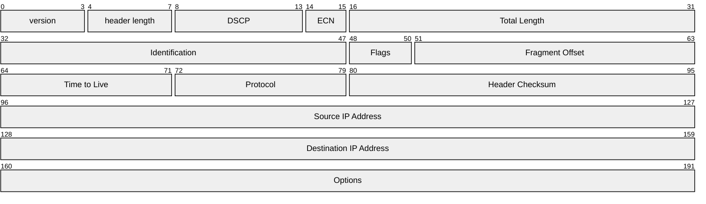
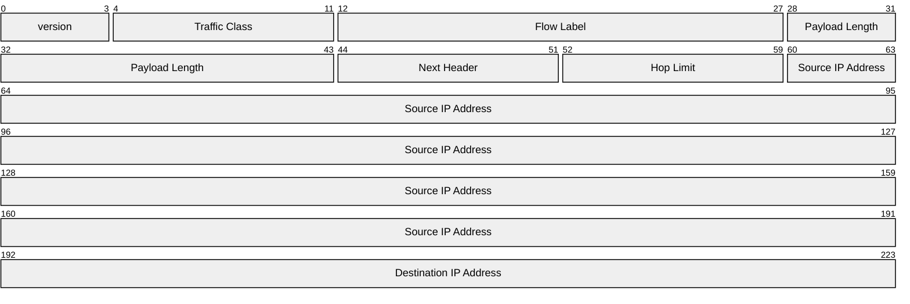

IP, NAT, middlebox 등이 이에 속한다.
이에 해당하는 장비로는 라우터가 있다.

# Services and Protocols

transport layer가 특정 장비에만 존재하는 것과 달리
network layer는 호스트, 라우터 등 모든 장비에 존재한다.

라우터는 자신을 지나가는 모든 IP 데이터그램의 헤더 필드를 검사한다.
그래서 어디로 이 데이터그램을 보낼지 결정한다.

두가지 기능을 하고 있는데, forwarding과 routing이다.
- forwarding: 패킷을 입력 링크에서 받아서 적절한 출력 링크로 내보내는 것
- routing: 패킷이 출발지에서 목적지까지 어떻게 전달되는지 결정하는 것
  - routing algorithm이 존재

또한 Data plane, control plane이 존재한다.
- data plane: forwarding table을 이용하여 패킷을 전달하는 것. local, per-router function
- control plane: 데이터그램이 라우터 사이에서 어떻게 전달되는지 결정하는 것.
  global, network-wide function
  - 두가지 방식이 있음
    - traditional routing algorithm: router에 구현 되어있음
    - software-defined networking (SDN): (remote) server를 통해 구현
      - 즉, remote server에 있는 forwarding table을 가져와서 사용하는 것이다.

# Network Service Model

각각의 데이터그램을 전달할 때, 전달을 보장하거나 일정 시간 안으로 전달이 되도록
보장하는 것들이 network service model이 될 수 있다.
전체적인 흐름으로 보았을 때에는 데이터그램이 순서대로 잘 전달되거나,
최소 대역폭을 보장하고, 패킷 간의 전송 간격을 일정하게 유지하는 것이 될 수 있다.

| Service Model                 | Throughput     | Loss     | Order    | Delay |
| ----------------------------- | -------------- | -------- | -------- | ----- |
| **Inernet (Best effort)**     | none           | no       | no       | no    |
| ATM (Constant Bit Rate)       | Constant Rate  | yes      | yes      | yes   |
| ATM (Available Bit Rate)      | Guaranteed min | no       | yes      | no    |
| Internet (Intserv Guarenteed) | yes            | yes      | yes      | yes   |
| Internet (Diffserv)           | possible       | possibly | possibly | no    |

Internet (Best Effort)의 경우에는 Network layer에서 제공하지 않기 때문에
상위 계층에서 복구 매커니즘을 사용해야한다.

그렇지만 그만큼 단순하기 때문에 널리 사용된다. Best Effort라는 것이
현재 주어진 상황에 최선을 다해서 데이터그램을 전달하는 것이라고 해석할 수 있다.
CDN과 같은 분산 네트워크를 사용할 때 클라이언트와 가장 가까운 서버에서
데이터를 전달해주는 것이 그 예로 볼 수 있다.
혼잡도를 개선하는 것은 탄력적인 서비스를 사용해서 네트워크의 성능을 개선할 수 있다.

# Routing Architecture

앞에서 말했듯이 router는 routing을 하는 control plane과
forwarding을 하는 data plane으로 나누어져있다.
control plane은 software이기 때문에 millisecond 단위로 작동하고,
routing을 처리하기 위한 high end CPU, 또는 전용 processor가 있다.
아래쪽에 있는 data plane은 hardware이기 때문에 nanosecond 단위로 작동하고,
router들이 계산이 되면 input ports의 forwarding table에 저장되어
고속 스위칭 패브릭을 통해 전달된다.

## Input port functions

- Line termination: Physical layer에서 비트 단위의 데이터 수신
- Link layer protocol (receive): 이더넷 프레임 수신 처리
- Lookup, forwarding, queueing: decentralized switching
  - forwarding table을 통해 패킷을 전달
  - 헤더 필드를 보고 어느 포트로 갈지 결정
  - 이때 목표는 input port에서 들어오는 속도 그대로 output port로 전달하는 것
    - destination IP를 보고 전달하는 destination-based forwarding,
      헤더 필드의 값을 보고 전달하는 generalized forwarding, SDN이 있다.
  - 만약에 데이터그램이 스위칭 패브릭의 포워딩 속도보다 빨리 도착하는 것을 대비하기 위해
    input port queueing이 존재한다.

### Longest prefix matching

forwarding table에 entry중에서 destination address와 일치하는 가장 긴 prefix를 찾는 것
조금 돌려서 말하는 구체적으로 매칭 되는 링크를 찾는 것이다.
이러면 라우팅 테이블의 크기를 줄이고 효율적으로 탐색할 수 있다.

실제로 Longest prefix matching은 TCAM(Ternary Content Addressable Memory)을 사용한다.
이 하드웨어는 매칭되는 entry를 찾는데 상수 시간이 걸린다.

## Switching fabric

입력포트에서 출력포트로 데이터를 전달하는 라우터의 내부 매커니즘이다.
여기에서 패킷이 입력에서 출력으로 전달되는 속도를 switching rate라고 부르는데,
N개의 입력포트, N개의 출력포트가 있고 line rate를 R이라고 할 때
switching rate는 $NR$이 된다.

세개지의 switching fabric이 존재한다.
- Memory: 버퍼 메모리를 사용하는 방식
- Bus: 공유 버스를 사용하는 방식
- Crossbar: N개의 입력포트와 N개의 출력포트를 연결하는 방식

### Switching via memory

전통적인 방식으로, 패킷이 메모리에 저장되고 다음 포트로 전달된다.
속도는 메모리의 대역폭에 제한 된다.

### Switching via bus

데이터그램이 입력 포트의 메모리에서 출력 포트의 메모리로 버스를 통해 바로 전달된다.
이때 속도는 버스의 대역폭에 의해 제한된다.
그리고 여러 입력 포트가 버스를 동시에 사용하려고 하면 bus contention이 발생해서
속도가 느려진다.

### Switching via interconnection network

Crossbar또는 Clos 네트워크를 사용한다. Crossbar Switch는 입력 포트와 출력 포트를
직접 연결하는 교차점이 있어, 입력 포트와 출력 포트가 직접 연결되고
동시에 여러 데이터그램을 병렬로 전송이 가능하다. 그래서 버스의 속도가 $R$라 하면
3개의 포트가 각각 있을 때 $3R$의 속도로 전송이 가능하다.
Crosspoint는 fabric controller에 의해서 열리거나 닫힌다.
만약에 두개의 입력 포트가 같은 출력 포트로 전달을 하려고 하면
하나의 버스는 한번에 하나의 패킷만 전달이 가능하기 때문에
하나의 전송이 끝날 때까지 기다리게 된다.

## Input Port Queueing

switch fabric이 input ports의 속도보다 느릴 때 input queueing이 발생한다.
또한 buffer overflow가 일어나면 queueing delay 또는 loss가 발생할 수 있다.

두가지 문제가 있는데
1. output port contention: 출력 포트 충돌
  - 동일한 출력 포트를 사용하는 입력 포트가 여러개일 경우
    이때 스위칭 패브릭은 한 번에 하나의 데이터그램만 전달이 가능하기 때문에
    나머지 데이터그램은 입력포트의 대기열에 대기하게 된다.
2. HOL Blocking (Head-of-the-Line Blocking)
  - output port contention에 의해서 앞쪽에 있는 데이터그램이 queueing되고 있으면
    뒤쪽에 있는 데이터그램은 앞쪽에 있는 데이터그램이 전달될 때까지 대기하게 된다.
    이는 큐ㅇ의 처리 속도를 저하시킨다.

## Output Port Queueing

output port의 속도가 switch fabric의 속도보다 느릴 때 버퍼가 필요하다.
이때 queueing delay나 loss가 buffer overflow 때문에 발생할 수 있다.

이 때 몇가지 결정 사항이 있다. 
1. 얼마나 많이 버퍼링 할 것인가
2. 버퍼가 다 찼을 때 어떤 데이터그램을 드랍할 것인가
3. 큐잉 되어있는 데이터그램을 어떤 순서로 전달할 것인가

### How much buffering?

평균 버퍼링은 RTT와 link capacity의 곱으로 결정된다.
(e.g. RTT가 250ms일 때 10Gbps의 link capacity는 2.5Gbit의 버퍼를 가짐,
실제로 버퍼의 크기가 이럴 수는 없음)

더 추천하는 방법은 N개의 연결이 있을 때 버퍼 크기는
$$
\frac{RTT \times C}{\sqrt{N}}
$$
이다.

하지만 버퍼링을 너무 많이 하면 딜레이가 발생한다.
RTT가 길어지는 경우 realtime application에서 성능이 저하되고, TCP 응답이 늦는다.
이상적으로는 bottleneck link를 적당히 가득 차게 하게, 가득 차지는 않게끔 해야한다.

### Buffer Management: Drop Policy

패킷이 가득찼을 때 어떤 패킷을 버릴 것인가에 대한 정책이다.

- tail drop: 도착한 패킷을 드랍
- priority: 우선순위가 낮은 패킷을 드랍

또 marking을 하여서 signal congestion에 해당하는 패킷을 마킹해둔다.

### Buffer Management: Scheduling

어떤 패킷이 다음 링크로 전달될지를 결정한다.
- FCFS
- priority
- Round Robin
- weighted fair queuing

#### FCFS

도착한 순서대로 전달한다.

#### Priority

도착한 트래픽은 분류가 된다음에 분류에 따라 큐에 들어간다.
헤더의 값이 분류에 사용될 수 있을 것이다.
높은 우선순위부터 패킷을 보낸다.
같은 우선순위에서는 FCFS를 사용한다.

#### Round Robin

도착한 트래픽을 분류하고 각각의 큐에 집어넣는 것은 priority와 비슷하다
하지만 패킷을 보낼 때는 각각의 큐에서 번갈아가면서 패킷을 보낸다.

#### Weighted Fair Queuing

Round Robin이 일반화 된 형태이다.
각각의 클래스 $i$는 가중치 $w_i$를 가지고 있고,
가중치에 따라서 패킷을 보낸다 (높은 가중치를 가진 클래스가 더 많이 보내진다)
$$
\frac {w_i} {\sum_j w_j}
$$
각 클래스마다 최소 대역폭이 보장된다.

# IP: Internet Protocol

## IP Datagram Format

TCP/IP에서는 40bytes의 오버헤드가 존재한다. (20bytes of TCP + 20bytes of IP)

## IP Fragmentation and Reassembly

IP 데이터그램은 MTU(Maximum Transmission Unit; link에 따라 다름)보다 크면
분할되어 전송된다. 큰 IP 데이터그램은 여러개의 작은 IP 데이터그램으로 나누어지고
목적지에서 다시 합쳐진다. IP에 있는 헤더를 보고 다시 합칠 수 있다.

예를 들어 4000byte의 데이터그램이 MTU = 1500byte인 링크를 따라 전달하기 위해서는
1500, 1500, 1000byte로 나누어서 전달이 되어야하는데, IP 헤더가 20bytes를
먹고 있기 때문에 실제로는 1480, 1480, 1040byte로 나누어진다.
IP 헤더의 ID를 같게 하고, fragment offset를 0, 185(1480/8), 370(2960/8)으로
설정한 다음 마지막 데이터그램에서만 fragment flag를 0으로 설정해서
마지막 데이터그램임을 명시해준다.

## IP Addressing

IP 주소는 32bits로 구성되어 있고, 4개의 8bits로 나누어져 있다.
각 identifier는 각 host와 router interface와 연결되어 있다.
(IP address는 interface와 연관 되어있지, 물리 장비와 연관 되어있는 것이 아니다)

interface는 host나 router에 연결되어 있는 물리적 링크를 의미한다.
router는 보통 여러개의 interface를 가지고 있고,
각각의 인터페이스끼리 연관되어있다.
host또한 한가지 이상의 interface를 가지고 있을 수 있다. (Ethernet, WiFi)

## Subnets

router를 통과하지 않고 물리적으로 서로 연결할 수 있는 디바이스 인터페이스의
집합이다. 같은 서브넷에 속한 장치들은 같은 네트워크 주소를 공유하고 있다.
즉, IP address는 subnet안에 있는 장비들이 같은 값을 가지는 subnet part와
host part로 나누어져있다.

subnet은 각 인터페이스를 호스트나 라우터에서 분리하여 고립된 네트워크를 생성해서
만들 수 있다. 이때 subnet mask는 IP 주소의 subnet part를 나타낸다.
CIDR(Classless Inter-Domain Routing)는 IP 주소를 a.b.c.d/x 형태로
표현하는데, 여기서 x는 subnet mask를 의미한다.
x의 값이 subnet part의 비트 길이를 나타낸다.

## DHCP: Dynamic Host Configuration Protocol

호스트가 네트워크에 연결 되었을 때 동적으로 IP주소를 네트워크 서버로부터
할당 받는 프로토콜이다.
- 사용중인 주소를 계속 사용할 수 있게 해준다
- 사용하지 않는 주소를 다른 호스트가 재사용할 수 있게 해준다
- 모바일 유저가 네트워크에 연결, 끊을 수 있게 해준다

1. host가 DHCP discover 메시지를 전달하고
2. DHCP server가 DHCP offset 메시지를 보내면
3. host는 IP 주소를 요청하는 DHCP request 메시지를 보내고
4. DHCP server가 DHCP ack 메시지를 보내서 호스트는 확인 받는다.

실제로 IP가 할당된 상태가 아니기 때문에 클라이언트를 특정할 수 없어서
모든 메시지는 broadcast 메시지로 전달된다. 그리고 각 호스트는
자신이 보낸 요청인지 구분하기 위해서 Transaction ID를 사용한다.

DHCP는 단순히 IP address를 할당하는 것 뿐만 아니라 추가적인 정보를 준다
- 클라이언트가 외부 네트워크와 통신할 때 사용할 게이트웨이, first-hop router의 주소
- DNS 서버 주소
- Subnet Mask - 이를 통해 클라이언트가 같은 서브넷에 속하는 장비인지를 구분함

## Hierarchical Addressing

또 ISP는 ISP가 가지고 있는 IP address block (ex: 200.23.16.0/20)이 있으면
그의 하위 집합을 ISP의 고객에게 할당할 수 있다.
(ex: 200.23.16.0/23, 200.23.18.0/23, ..., 200.23.30.0/23)

hierarchical addressing은 IP 주소를 계층적으로 나누어서 관리하는 것이다.
ISP는 여러 서브넷의 정보를 큰 블록 단위로 관리를 할 수 있고,
이를 통해 각각의 subnet에 대한 트래픽을 일일이 받는 것이 아니라
블록 단위로 트래픽을 한번에 받을 수 있다.
(라우팅 테이블의 크기가 줄어든다)
예를 들어 200.23.24.0/23 등 일일이 받아오지 않고 220.23.16.0/20으로
한번에 받아온다.

만약에 200.23.16.0/20에 속해있는 200.23.18.0/23 서브넷이
199.31.0.0/16 ISP 블럭을 가지고 있는 ISP B로 움직인다면
ISP B가 인터넷에 199.31.0.0/16, 200.23.18.0/23에 해당하는 트래픽을
받을 수 있게끔 하면, Internet의 라우팅 테이블은
Longest prefix matching에 의해서 200.23.16.0/20보다 더 긴 prefix를 가진
200.23.18.0/23으로 라우팅 되게 된다.

IP는 32bit인데, 남은 IP 주소가 있을까?
실제로 이를 관리하는 기구인 ICANN은 2011년에 마지막 청크를
RR(Regional Registries)에 할당했다.
IPv6또는 NAT(Network Address Translation)을 사용해서 이를 해결할 수 있다.

## NAT: Network Address Translation

NAT는 로컬 네트워크의 IP주소가 하나의 IPv4 주소로 외부 세상에 노출 되는 것이다.
즉, 로컬 네트워크에서 나가는 모든 데이터그램은 하나의 NAT IP 주소를 가지게 된다.
하지마 다른 포트번호를 가지기 때문에 이 포트번호를 통해 다시 로컬 네트워크로
데이터그램을 전달할 수 있다

로컬 네트워크에 있는 장비들은 사설 IP를 부여받게 된다.
(10/8, 172.16/12, 192.168/16)
이 주소들은 로컬 네트워크에서만 사용될 수 있다.

NAT의 장점들이 있다
- ISP로부터 하나의 IP 주소만 받으면 된다
- 로컬 네트워크의 IP 주소가 변경되더라도 바깥에 알릴 필요가 없다
- 내부 장비의 IP 주소를 바꾸지 않고도 ISP를 바꿀 수 있다
- 내부 장비는 바깥에서 바로 접근할 수 없는 보안적 이점이 있다

NAT를 구현하기 위해서는 세가지의 구현이 필요하다
1. outgoing datagram: (sourceIP, port#)를 (NAT IP address, new port#)로 변경.
   원격 서버는 (NAT IP address, new port#)로 응답
2. remember: 위에서 만든 두 페어를 기억
3. incoming datagram: (NAT IP address, new port#)를 (sourceIP, port#)로 변경해서
   로컬 네트워크로 전달

하지만 NAT에는 몇가지 논란이 있었다.
- router는 L3에서 동작하는데, 포트번호를 알기 위해서는 L4까지 올라가야 한다.
- address자체가 부족한 것은 IPv6로 해결해야한다.
- end-to-end principle을 위반한다.
  이 말은 router가 데이터를 전달하는 역할만 해야 하는데,
  중간에 IP주소와 포트를 변경하기 때문에
  데이터 흐름의 투명성을 떨어뜨린다는 것이다.
- NAT traversal의 문제가 있다. 만약에 클라이언트가 NAT 뒤에 있는 서버에
  연결하고 싶을 때에는 어떻게 해야 하는것일까? 

위와 같은 점에도 불구하고 NAT는
가정집이나, 기관 네트워크, 4G/5G 셀룰러 네트워크에서 사용된다.

### NAT Traversal

1. port forwarding: NAT 뒤에 있는 서버에 접근하기 위해서는
   NAT의 관리자가 NAT에게 특정 포트로 들어오는 패킷을 특정 IP로 전달하도록
   설정해야 한다.
2. UPnP(Universal Plug and Play), IGD(Internet Gateway Device) protocol
   - NAT가 UPnP를 지원하면, 클라이언트가 NAT에게 특정 포트로 들어오는 패킷을
     특정 IP로 전달하도록 요청할 수 있다.
3. relaying: 서버가 중간에 있는 서버를 통해서 데이터를 전달하는 방식이다.

## IPv6

IPv4의 주소가 부족해져서 나온 것이다.
IPv6는 40bytes의 고정된 헤더를 사용해서 라우터가 패킷 처리를 빨리 할 수 있도록 한다.

checksum이 없고, fragmentation, reassembly가 없으며, option이 없다.

IPv4와 IPv6가 한번에 존자할 수는 없기 때문에
혼합 환경을 지원할 수 있는 방법이 필요하다.
IPv6 데이터그램을 IPv4 데이터그램의 페이로드로 캡슐화 해서 IPv4 네트워크를 통해
전달하면 IPv4 네트워크 내에서도 IPv6 네트워크 간 통신이 가능하다.
