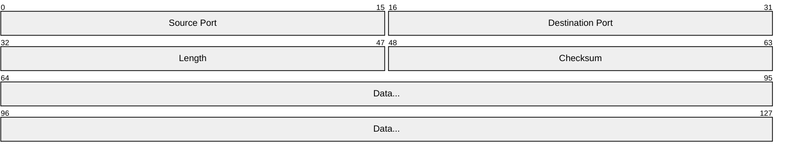
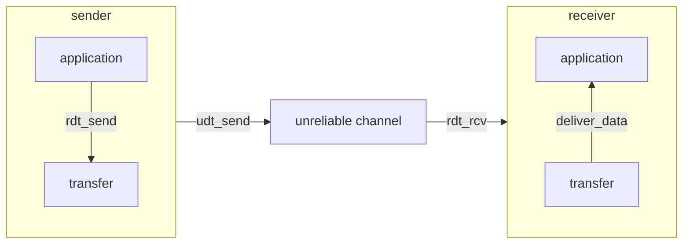
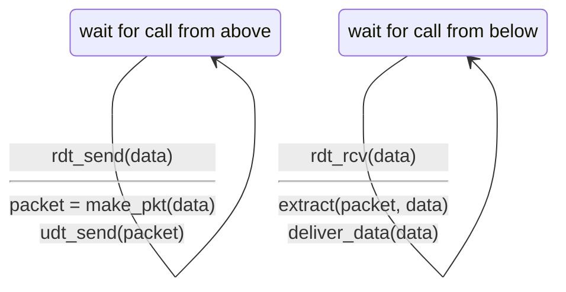
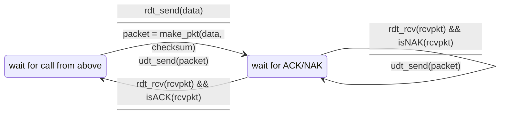
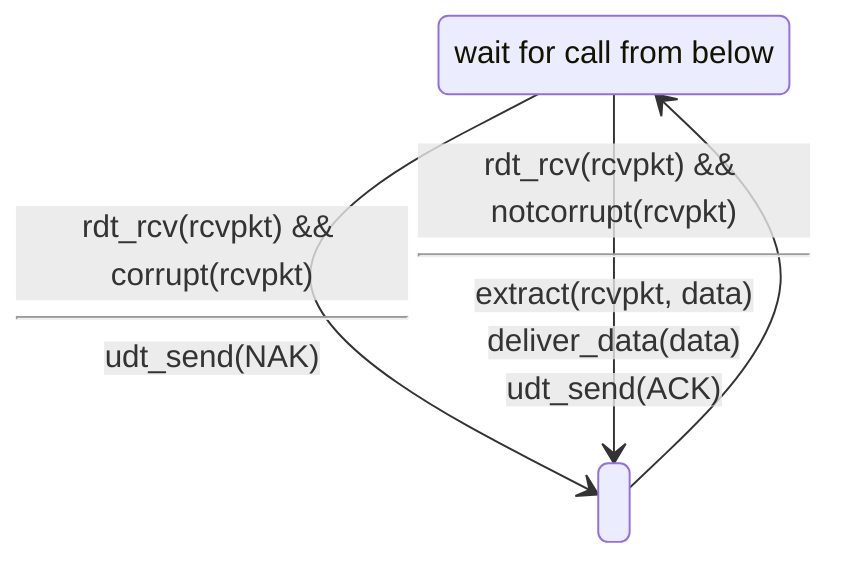
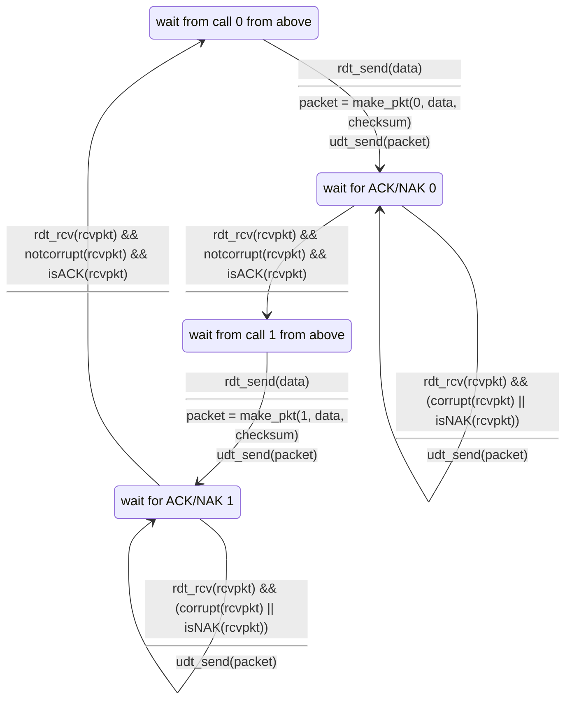
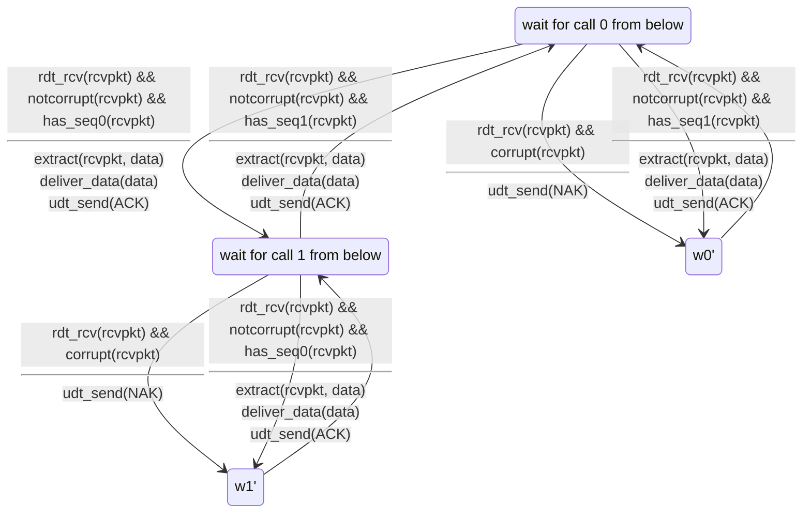
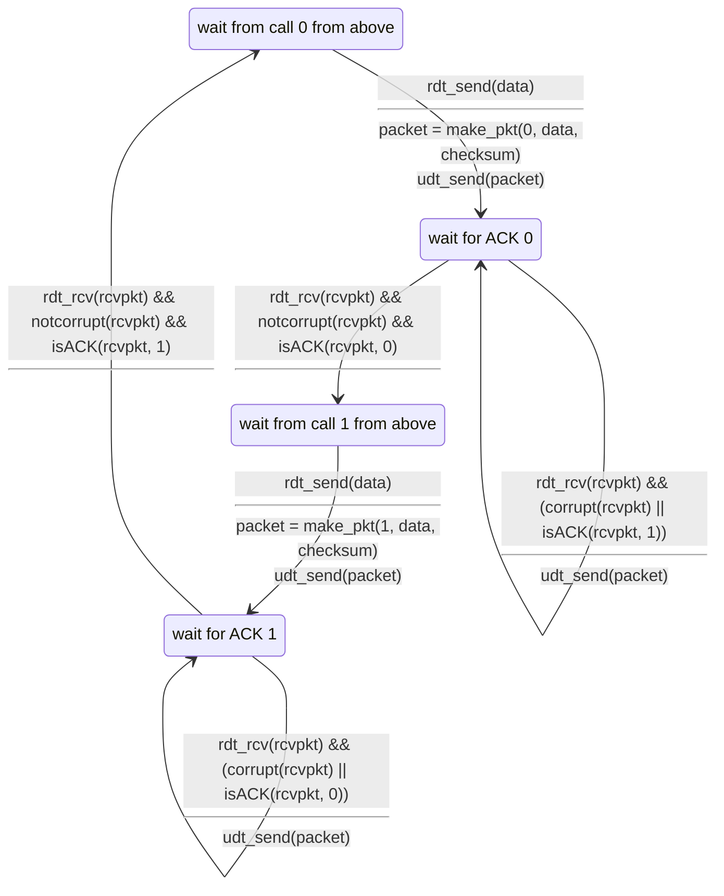
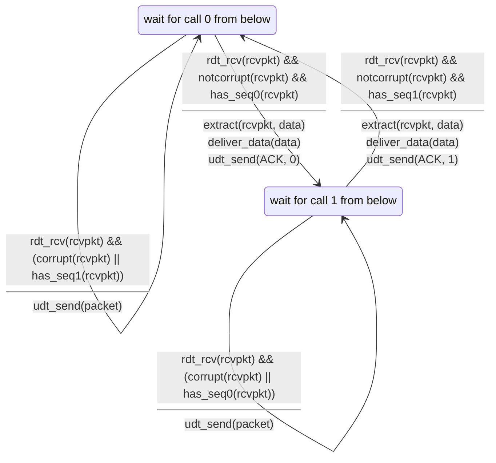
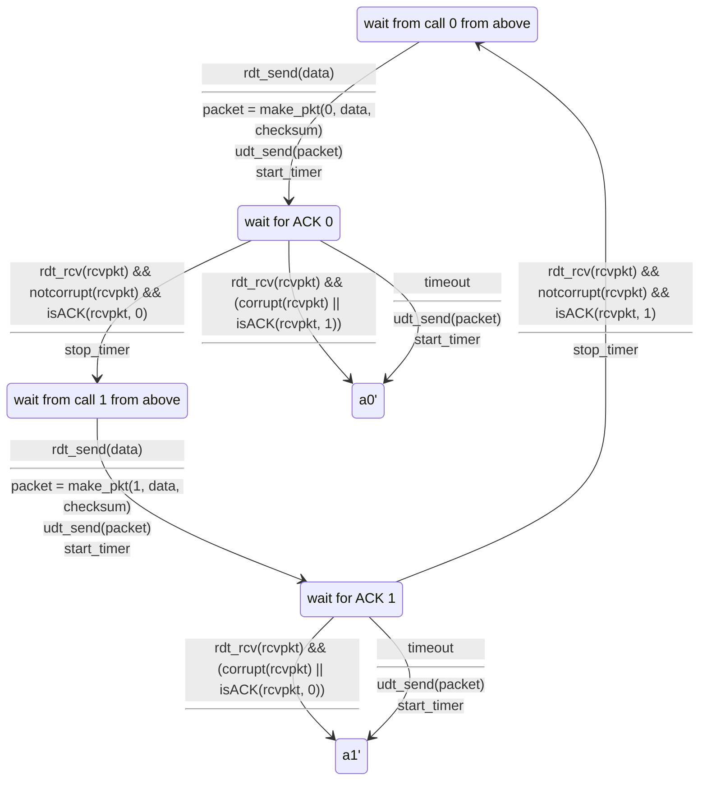

# UDP: User Datagram Protocol

connectionless한 프로토콜이고,
TCP와 다르게 handshake과정이 없다.
각 UDP segment는 독립적으로 처리된다.

- 장점
  - connection establishment가 없기 때문에 RTT 딜레이가 적다
  - 단순: connection state가 없다
  - header size가 적다
  - congestion control이 없다
    - UDP는 원하는 만큼 빠르게 전달 된다
    - 혼잡하더라도 기능을 한다

UDP는 streaming 서비스, DNS, SNMP, HTTP/3에 사용되며
UDP위쪽 층에서 reliable transfer가 필요하다.



## UDP Checksum

bit flip등의 오류를 검출하기 위해 사용된다.

- sender에서는 패킷을 16-bit word로 쪼개고, 1의 보수를 취한 후 모두 더한다
- receiver에서는 sender에서 계산한 값과 receiver에서 계산한 값이 같은지 확인한다

# Reliable Data Transfer

application layer에서는 reliable data transfer가 필요하다.
하지만 전달하는 계층이 unreliable하다면
위쪽에서 reliable data transfer protocol을 구현해야 한다.

## rdt interface

- `rdt_send(data)`: 위쪽 레이어에서 아래쪽으로 데이터를 전달
- `udt_send(data)`: rdt에서 unreliable channel을 통해 데이터를 전달
- `rdt_rcv(data)`: 데이터가 도착했을 때 호출
- `deliver_data(data)`: rdt에서 위쪽 레이어로 데이터를 전달



## rdt1.0

채널에서 bit error, packet loss가 없다고 가정, 즉 reliable channel에서의 전송이다.



```mermaid
stateDiagram-v2
```

## rdt2.0: channel with bit errors

채널에서 bit error가 발생할 수 있다.
이때 checksum을 활용하면 검출할 수 있는데,
rdt는 여기에서 에러를 복구하는 방법을 사용한다.

rdt2.0에서 사용되는 두가지 응답이 있는데
- `ACK`: positive acknowledgment
- `NAK`: negative acknowledgment

sender는 `ACK`를 받으면 다음 데이터를 보내고,
`NAK`를 받으면 이전 데이터를 다시 보낸다.

> stop and wait: sender는 하나의 패킷을 보내고, receiver는 하나의 패킷을 받아야 다음 패킷을 보낼 수 있다.





하지만 ACK/NAK 패킷 자체가 corrupt 될 수도 있다.
이때 sender다 다시 패킷을 보내게 되면 중복 패킷이 발생할 수 있다.
그래서 2.1에서는 sequence number를 사용한다.
역시 stop and wait이다.

## rdt2.1: channel with bit errors and sequence numbers





정리하자면,
sender 입장에서는 패킷에 sequence number를 붙이고,
ACK/NAK이 corrupt되었는지 확인하는 것이다.
두개의 sequence number로 충분한 이유가
방금 보낸 것과 이전에 보낸 것을 구분하기 위함이다.
(stop and wait이어서 동시에 하나의 패킷만 보낼 수 있기 때문)
receiver는 sequence number를 확인하고,
이전에 받은 것과 중복되는 것이 오지 않도록 한다.
receiver는 receiver가 보낸 ACK또는 NAK이 sender가 잘 받았는지는 모른다.

## rdt2.2: channel with bit errors, sequence numbers, and ACKs only

NAK를 사용하지 않고 ACK만 사용하는데, 대신에 마지막으로 보낸
ACK 패킷을 전달한다. 이때 ACK와 같이 패킷 넘버를 전달하게 된다.





## rdt3.0: channels with errors and loss

unreliable channel이 패킷을 손실할 수 있다고 가정하면,
timeout을 설정해서 패킷을 재전송한다.
이때 단순히 패킷이 손실이 된게 아니라 늦게 보내진 것일 수도 있기 때문에
패킷을 재전송하면 중복 패킷이 발생할 수 있지만
sequence number로 이를 구분할 수 있다.



이때에 ACK가 지연되면 모든 ACK 패킷이 중복되어 전송될 수 있다.
만약에 이 패킷을 sender가 중복으로 처리하면 패킷이 꼬이기 때문에 무시해야 한다.

## Utilization improvement - pipelined protocol

rdt3.0은 좋지만, stop and wait이기 때문에
sender와 receiver가 동시에 하나의 패킷만 보내고 받는다.
performance가 좋지 않다.

예를들어 1Gbps link에서 15ms의 propagation delay가 있고, 8000bit의 패킷을
보낸다고 생각을 했을 때

$$
D_{trans} = \frac L R = \frac {8000 \text{bits}} {10^9 \text{bits} / \text{sec}}
= 8 \text{microsecs}
$$
위와 같이 나온다.

여기에서 Utilization $U_{sender}$, sender가 패킷을 보내는데에 할애하는 비율을 계산하면

$$
U_{sender} = \frac {D} {D + 2 \times \text{propagation delay}}
= \frac {L / R} {RTT + L / R}
= \frac {0.008} {30.008}
= 0.00027
$$
위와 같이 나온다.

utilization이 겨우 0.027%로 나온다.
1Gbps link를 사용하고 있지만, 0.027%인 270kbps로 보내고 있는 것이다.
프로토콜이 그 밑에 있는 infrastructure, channel의 자원을 충분히 사용하지
못하고 있는 것이다.

## Pipelining: increased utilization

sender가 여러개의 패킷을 한번에 보낼 수 있게 한다면
배로 빠르게 데이터를 보낼 수 있다.
ACK를 실제로 받진 않았지만, ACK를 받을것으로 예상하고 패킷을 보내는 것이다.
이전 프로토콜에서는 0, 1, 0, 1, 0, 1, ...의 sequence number를 사용했다면
sequence number의 범위가 넓어지게 될 것이다.
그리고 여러가지 패킷을 기억하고 있다가 ACK가 오지 않으면 다시 보내야하기 때문에
sender는 버퍼를 가지고 있어야 하고,
receiver는 패킷 손실에 대비하기 위해서 받은 패킷을 저장할 버퍼가 필요하다.

이를 구현하는 프로토콜이 두가지가 있다.
똑같이 N개의 ACK되지 않은 패킷을 보내는 것이지만,
- Go-Back-N: Receiver는 cumulative하게 ACK를 보낸다.
이 말은 즉슨, gap이 발생한 경우 ACK를 보내지 않는 것이다.
sender는 timer를 가지고 timer가 끝나면 unACKed 된 패킷을 다시 보낸다.
데이터 전송을 위해서 추가적인 버퍼가 필요하지 않다.
- Selective Repeat: Receiver는 각각의 패킷에 대해서 ACK를 보낸다.
sender는 각 패킷에 대해서 timer를 가지고 있다가
timer가 끝나면 해당 패킷만 다시 보낸다.
data transmission은 줄어들지만, 버퍼링이 필요하다.

## Go-Back-N

sender는 N이라는 window사이즈까지 한번에 보낼 수 있고,
ACK(n)을 받으면 n까지의 패킷은 모두 받았다고 가정한다.
만약에 ACK(n)을 timeout이 될때까지 받지 못했다면 n까지의 패킷을 다시 보내고,
n이 보낸 패킷에 못 미치는 경우에는 n+1부터 다시 보낸다.

다시 풀어서 설명하면 정해진 window size만큼 뭉텅이로 보내는데,
모두 잘 보내졌다면(ACK(nextseqnum-1)을 받았다면) 다음으로 옮겨서 보내고,
ACK(n)에서 n이 nextseqnum-1보다 작으면 nextseqnum부터 nextseqnum+N-1까지
다시 보낸다.

sender 입장에서는 packet이 순서대로 올 때 그에 맞는 ack 번호로 응답을 하고,
건너뛴 패킷이 들어오면 이전에 마지막으로 응답했던 ack 번호로 다시 응답을 해서
sender가 그 다음패킷부터 다시 전송하도록 한다.
만약에 패킷이 전부 손실되어 전달되지 않더라도 sender가 가지고 있는 timeout에
의해서 패킷이 재전송 될 것이다.

## Selective Repeat

receiver가 각각의 패킷에 대해서 ACK 응답을 보내는 것이다.
이 방식은 버퍼가 필요하다. 왜냐하면 transport 계층에서는 무작위 순서대로
패킷이 들어오더라도 상위 계층에 전달을 할 때에는 순서대로 전달이 되어야 하기
때문이다.
sender가 timeout이 되면 unACKed 된 패킷을 다시 보낸다.
이때 하나의 timer를 가지고 있는게 아니라 각 패킷마다 타이머를 가지게 될 것이다.
Go-Back-N처럼 N개의 window를 가지고 있고, 한번에 N개의 unACKed 패킷을 보낼 수 있다.
ACK(n)에서 n이 window에서 가장 작은 패킷 번호라면 window를 옮겨서
다음 패킷을 보낼 수 있도록 한다.

receiver 입장에서는 받은 패킷에 대해서 ACK(n)을 보내고,
순서에 맞지 않은 패킷은 버퍼에 저장한다.
그리고 위쪽 레이어에는 패킷 순서대로 전달을 하며,
누락된 패킷이 채워진다면 그 이후 패킷을 다시 순서대로 전달한다.
혹여나 이미 위쪽으로 보낸 패킷이 중복되어서 올때가 있는데
(ACK 패킷이 loss된 경우)
이때는 다시 ACK(n)을 보내서 sender에게 해당 패킷을 받았음을 다시 알려준다.

### dilemma in Selective Repeat

위에서 언급한 ACK 패킷이 loss된 경우에 문제가 생긴다.
window size와 sequence number의 범위가 같다면
sender가 ACK패킷을 못 받았을 때 동일한 sequence number를 사용한 이전 패킷을
sender가 재전송하면서 receiver 입장에서는 뒤쪽 패킷을 받아야하는데
앞쪽 패킷을 똑같이 반복해서 받는 문제가 생긴다.
window size와 sequence number의 범위가 비슷한 것을 가정했기 때문에
위에서 언급한대로 무시를 할 수가 없는 상황이다.
이를 해결하기 위해서는 sequence number의 범위를 window size보다 2배 크게 하면 된다.

