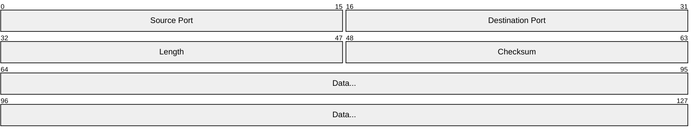
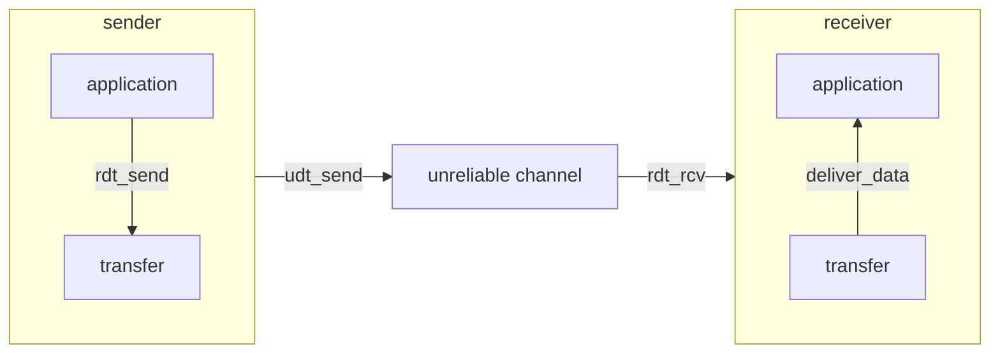
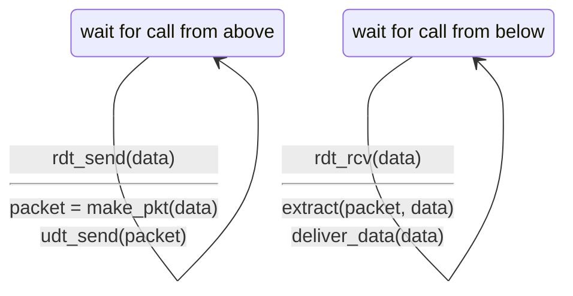
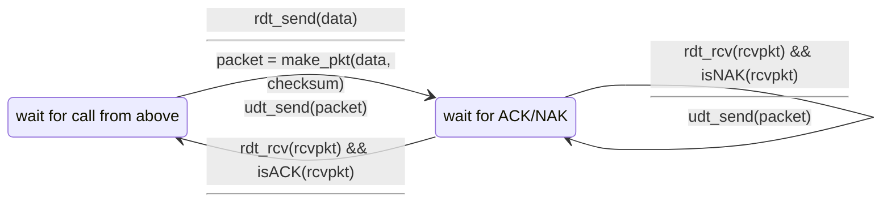
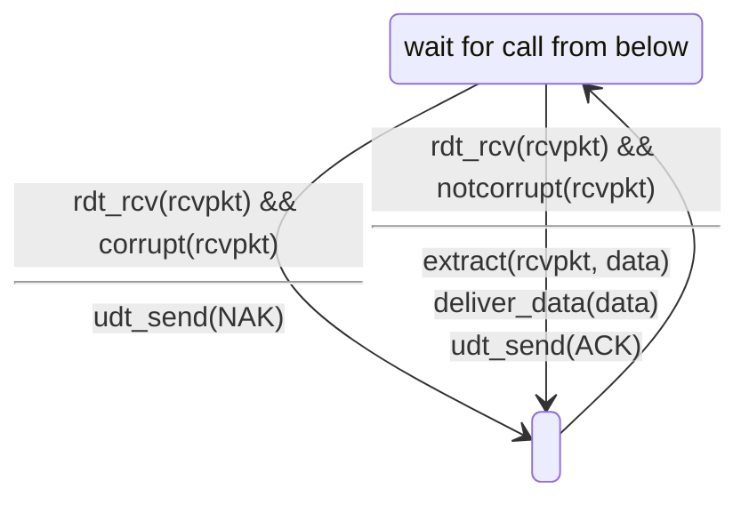
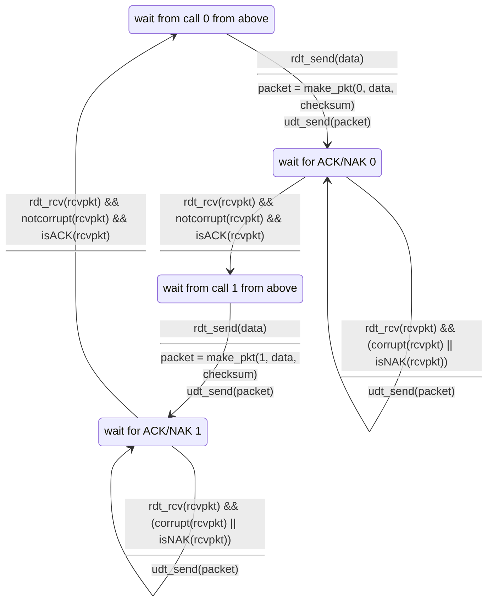
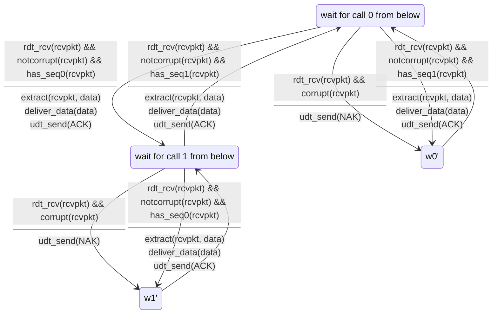
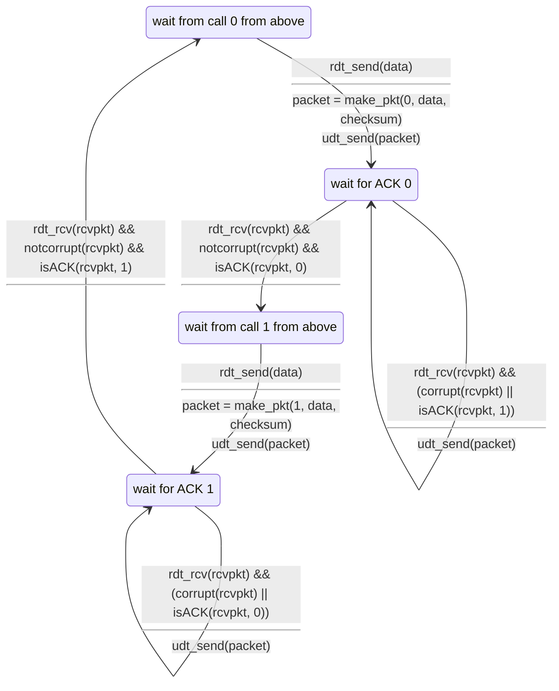
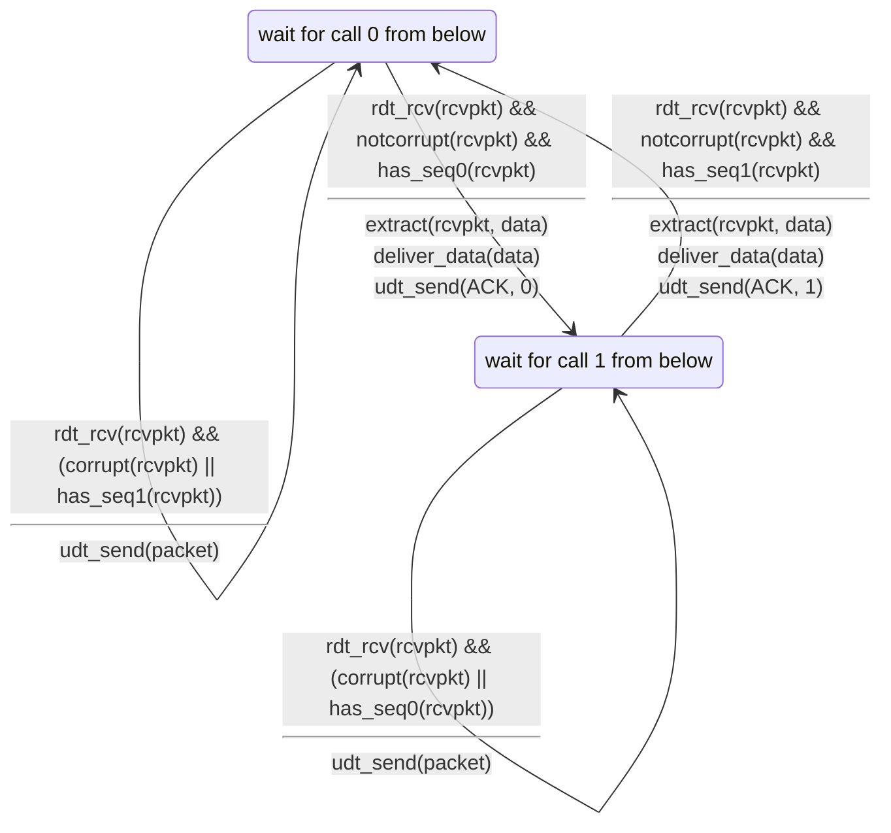
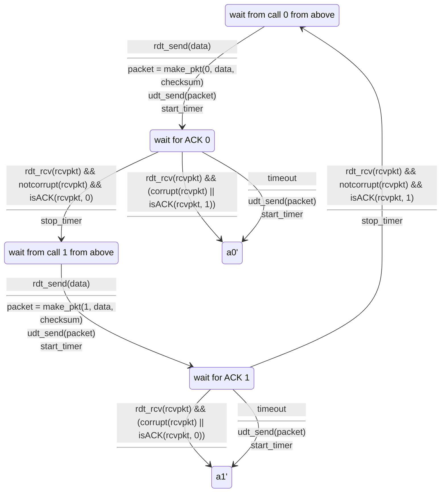

# UDP

User Datagram Protocol

connectionless한 프로토콜이고,
TCP와 다르게 handshake과정이 없다.
각 UDP segment는 독립적으로 처리된다.

- 장점
  - connection establishment가 없기 때문에 RTT 딜레이가 적다
  - 단순: connection state가 없다
  - header size가 적다
  - congestion control이 없다
    - UDP는 원하는 만큼 빠르게 전달 된다
    - 혼잡하더라도 기능을 한다

UDP는 streaming 서비스, DNS, SNMP, HTTP/3에 사용되며
UDP위쪽 층에서 reliable transfer가 필요하다.



## UDP Checksum

bit flip등의 오류를 검출하기 위해 사용된다.

- sender에서는 패킷을 16-bit word로 쪼개고, 1의 보수를 취한 후 모두 더한다
- receiver에서는 sender에서 계산한 값과 receiver에서 계산한 값이 같은지 확인한다

# Reliable Data Transfer

application layer에서는 reliable data transfer가 필요하다.
하지만 전달하는 계층이 unreliable하다면
위쪽에서 reliable data transfer protocol을 구현해야 한다.

## rdt interface

- `rdt_send(data)`: 위쪽 레이어에서 아래쪽으로 데이터를 전달
- `udt_send(data)`: rdt에서 unreliable channel을 통해 데이터를 전달
- `rdt_rcv(data)`: 데이터가 도착했을 때 호출
- `deliver_data(data)`: rdt에서 위쪽 레이어로 데이터를 전달



## rdt1.0

채널에서 bit error, packet loss가 없다고 가정, 즉 reliable channel에서의 전송이다.



```mermaid
stateDiagram-v2
```

## rdt2.0: channel with bit errors

채널에서 bit error가 발생할 수 있다.
이때 checksum을 활용하면 검출할 수 있는데,
rdt는 여기에서 에러를 복구하는 방법을 사용한다.

rdt2.0에서 사용되는 두가지 응답이 있는데
- `ACK`: positive acknowledgment
- `NAK`: negative acknowledgment

sender는 `ACK`를 받으면 다음 데이터를 보내고,
`NAK`를 받으면 이전 데이터를 다시 보낸다.

> stop and wait: sender는 하나의 패킷을 보내고, receiver는 하나의 패킷을 받아야 다음 패킷을 보낼 수 있다.





하지만 ACK/NAK 패킷 자체가 corrupt 될 수도 있다.
이때 sender다 다시 패킷을 보내게 되면 중복 패킷이 발생할 수 있다.
그래서 2.1에서는 sequence number를 사용한다.
역시 stop and wait이다.

## rdt2.1: channel with bit errors and sequence numbers





정리하자면,
sender 입장에서는 패킷에 sequence number를 붙이고,
ACK/NAK이 corrupt되었는지 확인하는 것이다.
두개의 sequence number로 충분한 이유가
방금 보낸 것과 이전에 보낸 것을 구분하기 위함이다.
(stop and wait이어서 동시에 하나의 패킷만 보낼 수 있기 때문)
receiver는 sequence number를 확인하고,
이전에 받은 것과 중복되는 것이 오지 않도록 한다.
receiver는 receiver가 보낸 ACK또는 NAK이 sender가 잘 받았는지는 모른다.

## rdt2.2: channel with bit errors, sequence numbers, and ACKs only

NAK를 사용하지 않고 ACK만 사용하는데, 대신에 마지막으로 보낸
ACK 패킷을 전달한다. 이때 ACK와 같이 패킷 넘버를 전달하게 된다.





## rdt3.0: channels with errors and loss

unreliable channel이 패킷을 손실할 수 있다고 가정하면,
timeout을 설정해서 패킷을 재전송한다.
이때 단순히 패킷이 손실이 된게 아니라 늦게 보내진 것일 수도 있기 때문에
패킷을 재전송하면 중복 패킷이 발생할 수 있지만
sequence number로 이를 구분할 수 있다.



이때에 ACK가 지연되면 모든 ACK 패킷이 중복되어 전송될 수 있다.
만약에 이 패킷을 sender가 중복으로 처리하면 패킷이 꼬이기 때문에 무시해야 한다.

## Utilization improvement - pipelined protocol

rdt3.0은 좋지만, stop and wait이기 때문에
sender와 receiver가 동시에 하나의 패킷만 보내고 받는다.
performance가 좋지 않다.

예를들어 1Gbps link에서 15ms의 propagation delay가 있고, 8000bit의 패킷을
보낸다고 생각을 했을 때

$$
D_{trans} = \frac L R = \frac {8000 \text{bits}} {10^9 \text{bits} / \text{sec}}
= 8 \text{microsecs}
$$
위와 같이 나온다.


