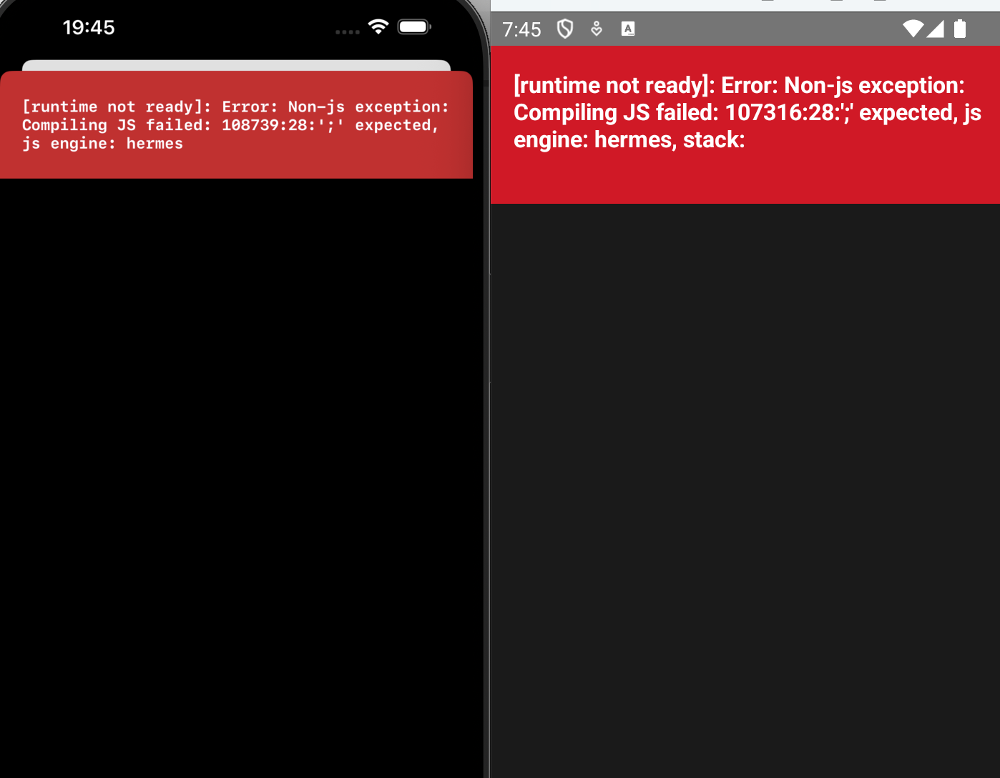

오늘부터 React Native를 다루게 되었다.
때문에 React Native에서 일어나는 troubleshooting 관련 글이 많을 예정이다.
특히나 pnpm monorepo 환경에서 RN을 사용하고 있기 때문에 더욱 특수한 상황일 것이다.

RN에서 어떤 문제가 일어나면 일단은 `pnpm start --reset-cache`와 `pnpm run ios`,
`pnpm run android`를 다시 실행해서 새로운 환경으로 만들어보는 것이
중요한 것 같다. 알 수 없는 이유로 인해서 잘 돌아가던 코드들이 안 돌아가는
이슈가 경험상으로 많았던 것 같다.

지금 사용하는 환경은 아래와 같다.

- React: 19.1.0
- React Native: 0.80.1

## Runtime Not Ready error

RN을 사용할 때 콘솔에서는 에러가 안 뜨고 아래처럼 앱 화면에서 에러가 뜰 수 있다.


```text
[runtime not ready]: Error: Non-js exception: Compiling JS failed:
107316:28:';' expected, js engine: hermes, stack:
```

이는 RN에서 지원되지 않는 Top-Level await을 사용해서 그런 것이다.
Top-Level에서 사용된 await를 다른 방식으로 수정해주면 된다.
